[Github URL](https://github.com/bowlashark/1132-2N-demo-51)

### W01-P1: Create a Github repo for 1132 semester

#### => Github repo

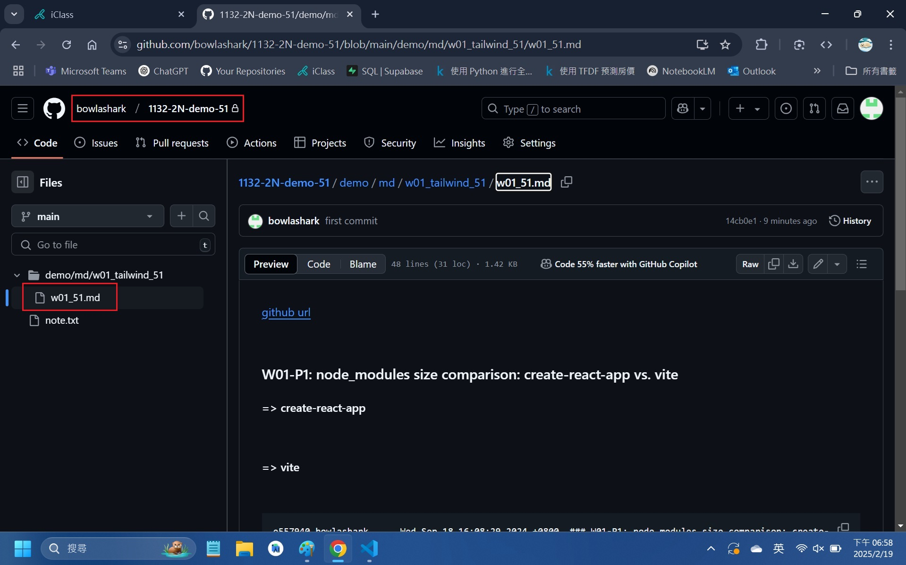

#### => share to teacher and TA

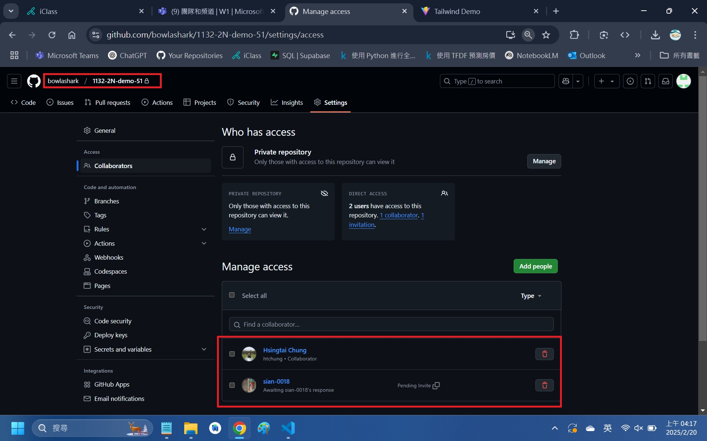

```
5540e5a bowlashark      Wed Feb 19 19:01:09 2025 +0800  W01-P1: Create a Github repo for 1132 semester
14cb0e1 bowlashark      Wed Feb 19 18:49:23 2025 +0800  first commit
```

### W01-P2: Setup vite and tailwindcss, show your name and id

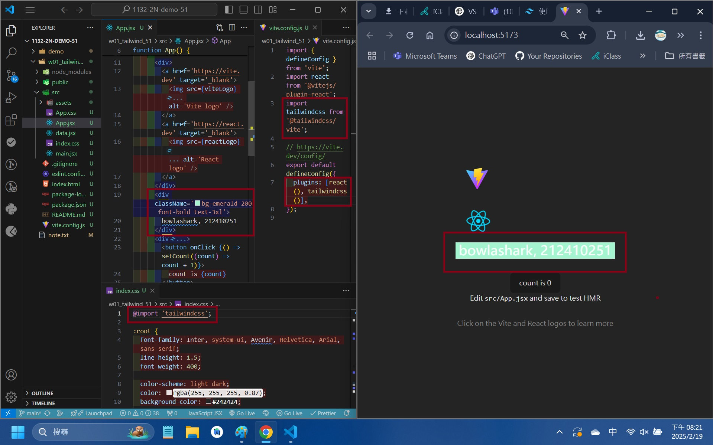

```
7d87883 bowlashark      Wed Feb 19 20:23:34 2025 +0800  W01-P2: Setup vite and tailwindcss, show your name and id
```

### W01-P3: Show Navbar_51 responsive from links data

#### => for screen size < 640px

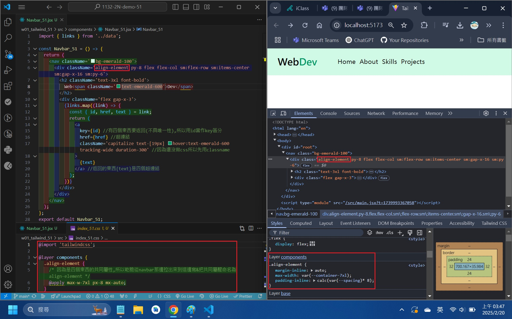

#### => for screen size > 640px (small)

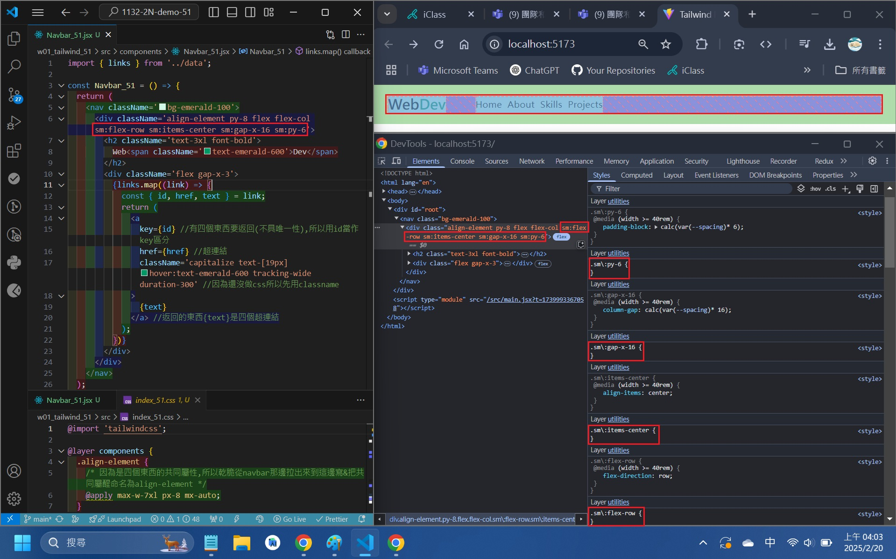

```
3228e74 bowlashark      Thu Feb 20 04:10:52 2025 +0800  ### W01-P3: Show Navbar_51 responsive from links data
```

### W01-git logs

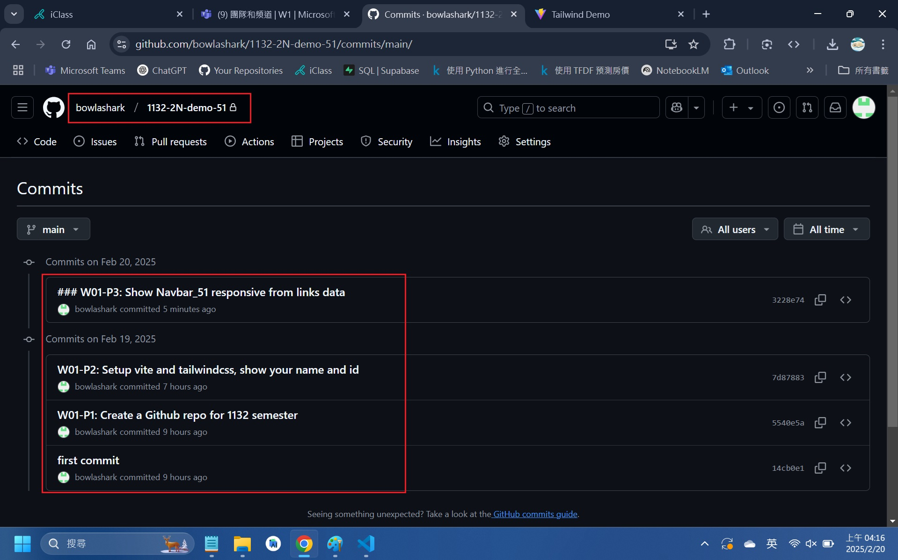

### note

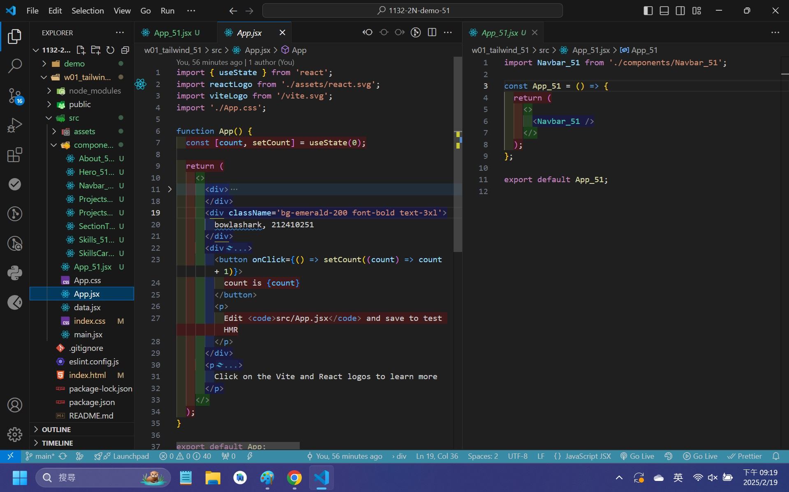
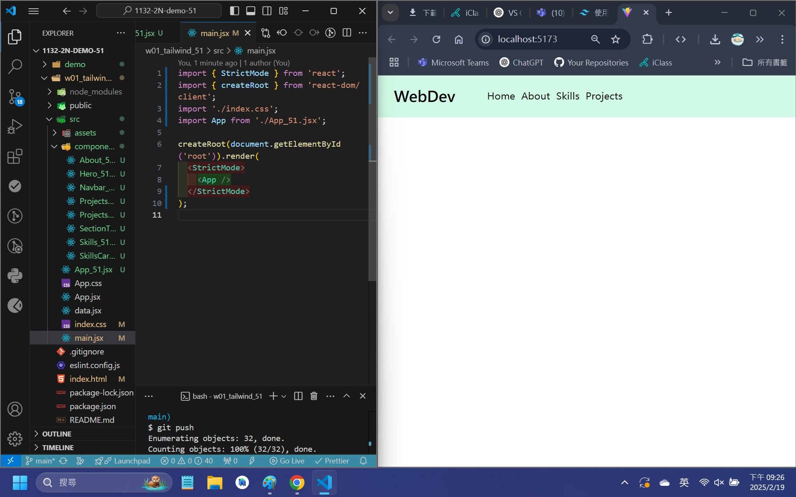
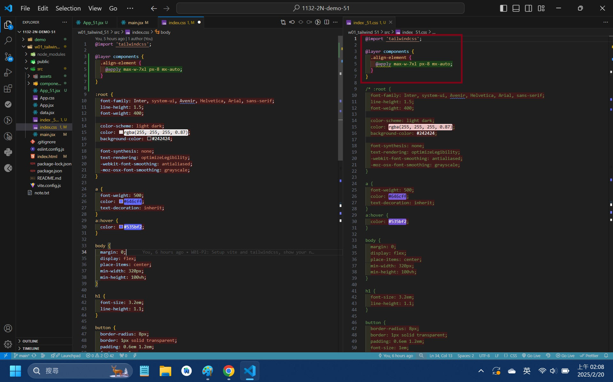
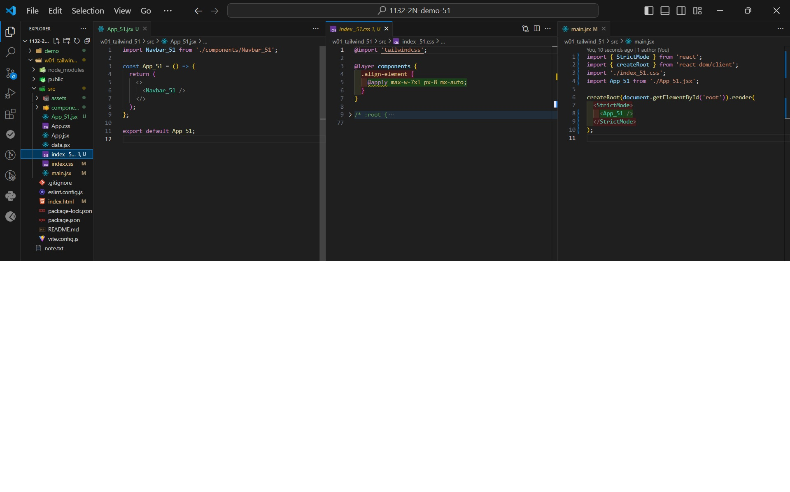
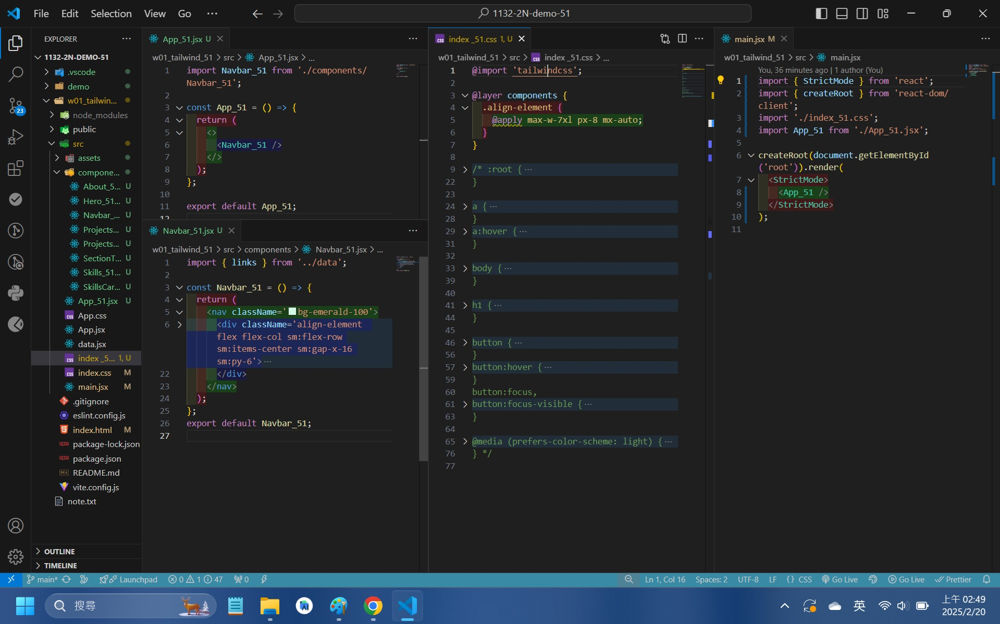
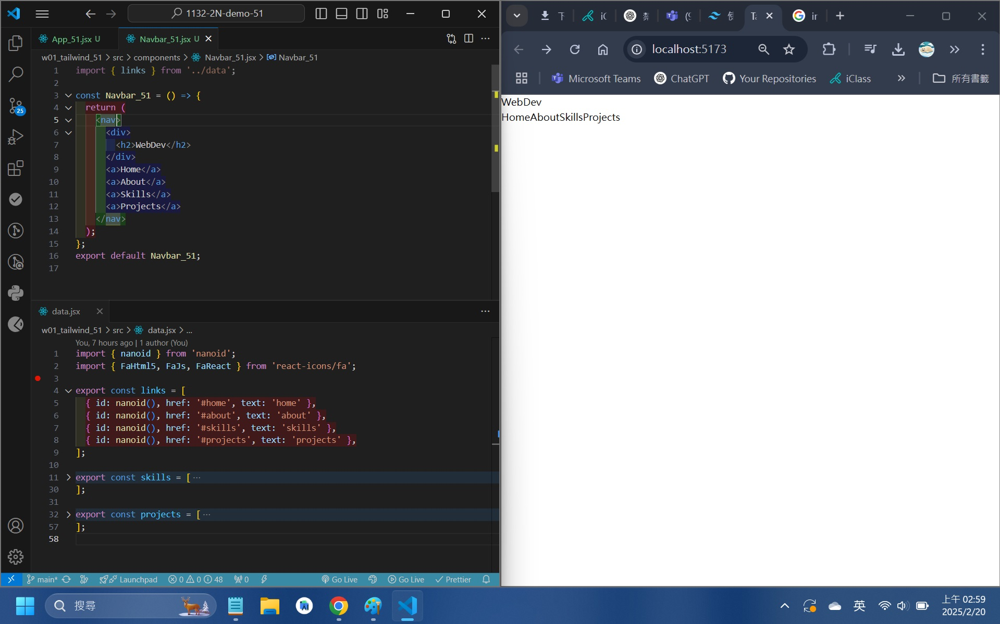
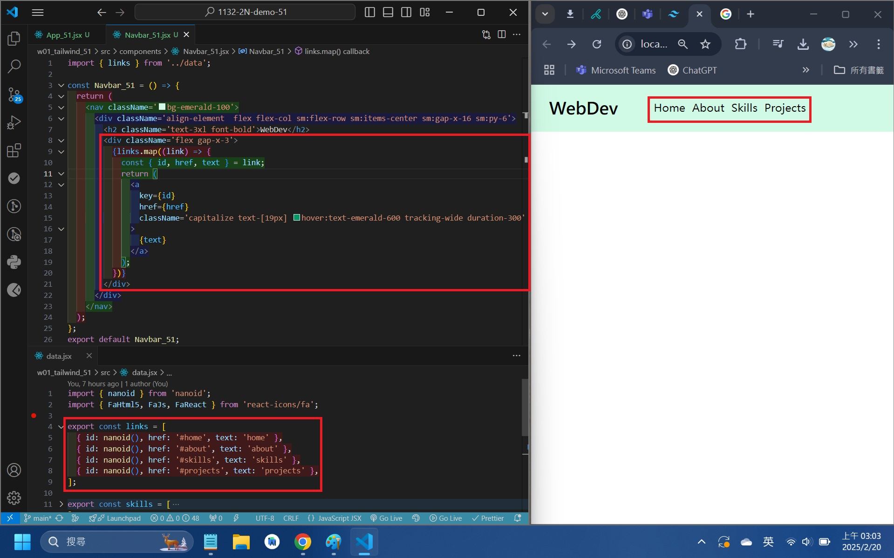
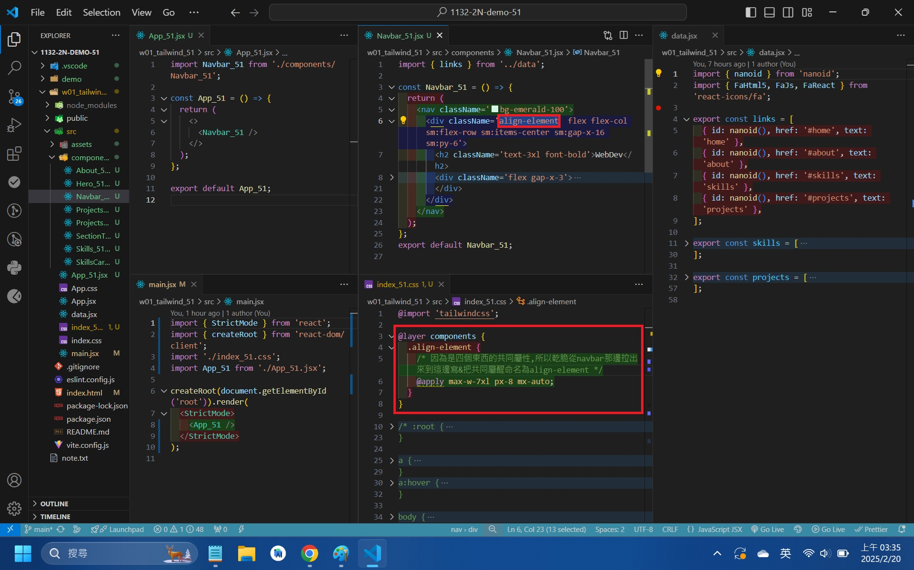
