[Github URL](https://github.com/bowlashark/1132-2N-demo-51)
之前 component 只有 client,現在是 component=client+server

### W02-P1: Show <Hero_51 > with screen width = 768px

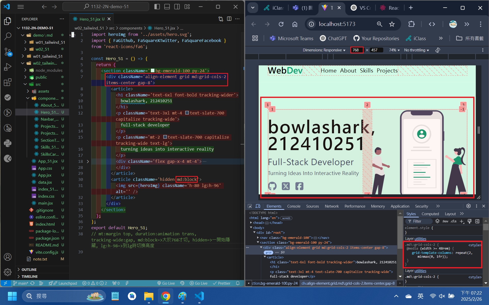

```
git log --pretty=format:"%h%x09%an%x09%ad%x09%s" --after="2025-02-25"
```

### W02-P2: Show <About_51 /> with <SectionTitle_51 />

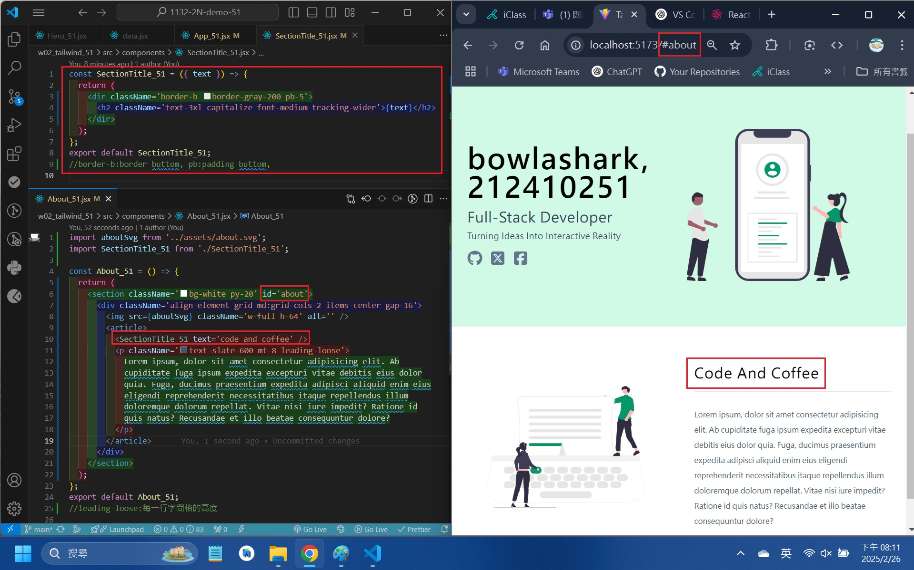

```
495ff39 bowlashark      Wed Feb 26 20:14:47 2025 +0800  W02-P2: Show <About_51 /> with <SectionTitle_51 />
```

### W02-P3: Show <Projects_51 /> with responsiveness

#### => two projects in a row

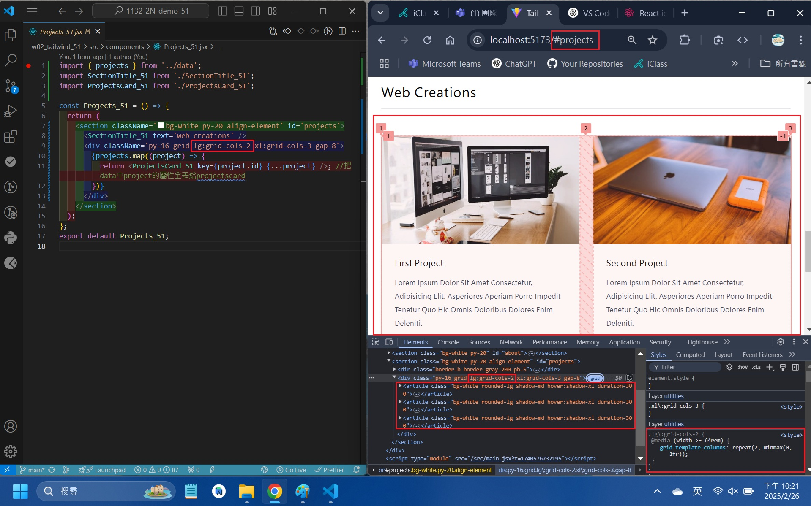

#### => three projects in a row

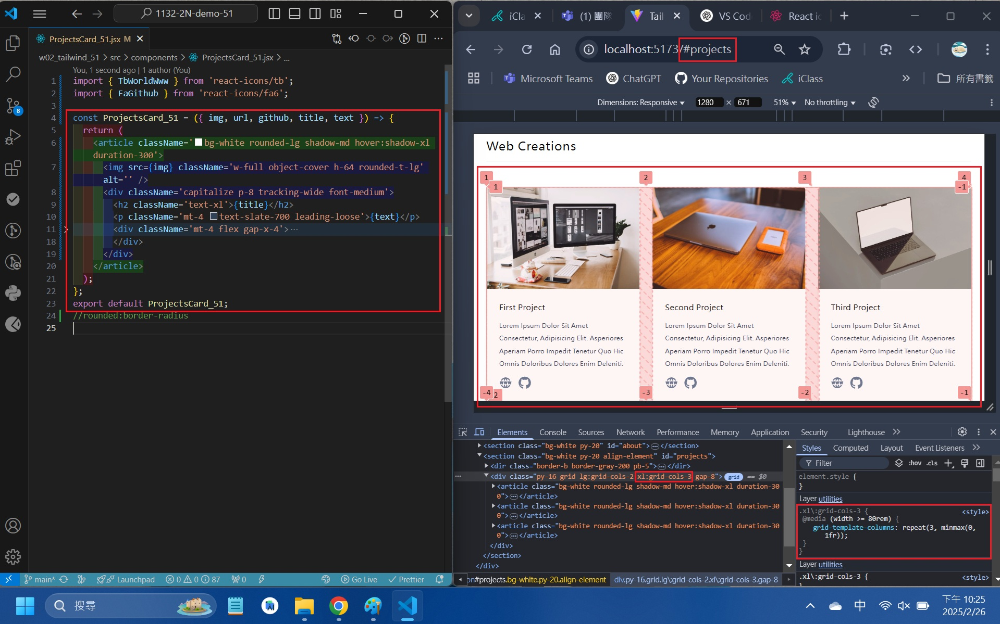

```
bbbcf6e bowlashark      Wed Feb 26 22:34:35 2025 +0800  ### W02-P3: Show <Projects_51 /> with responsiveness
```

### W02-p4:Show <Skills_51 /> with responsiveness

#### => two projects in a row

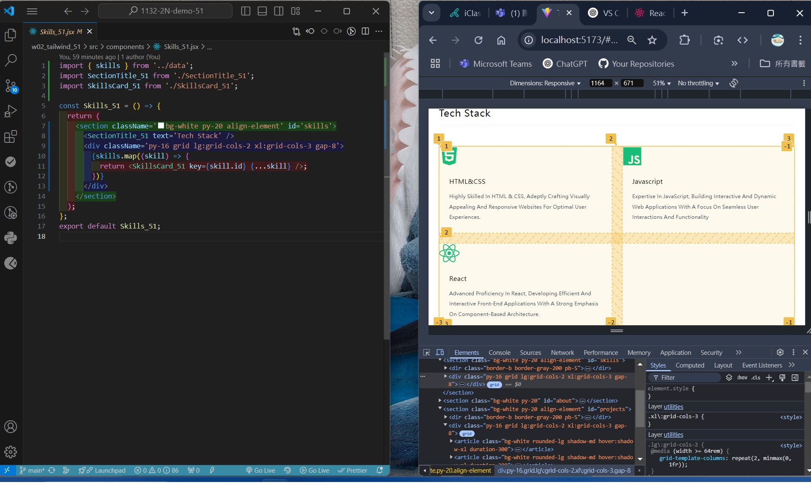

#### => three projects in a row


```
d214ecf bowlashark      Wed Feb 26 22:35:34 2025 +0800  W02-p4:Show <Skills_51 /> with responsiveness
```

### W02-logs: git logs of W02

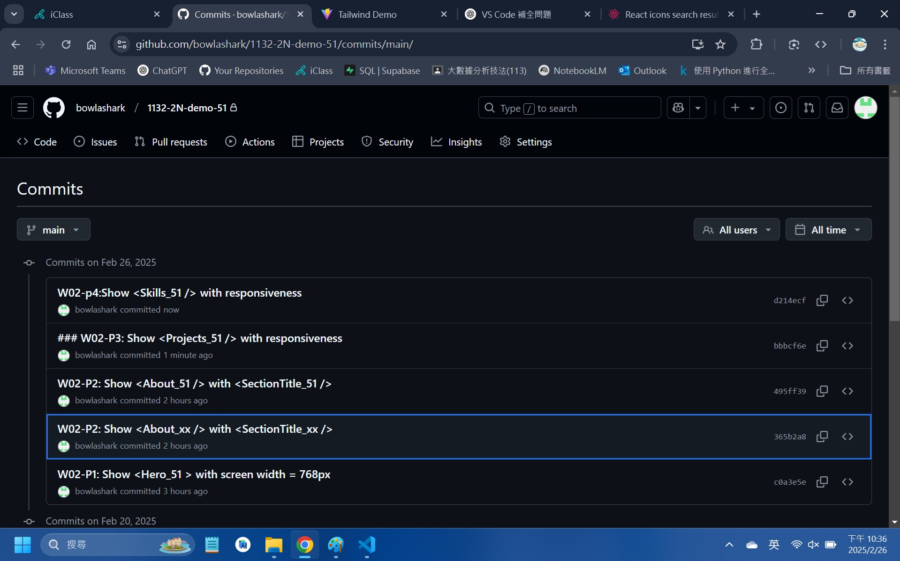

### note

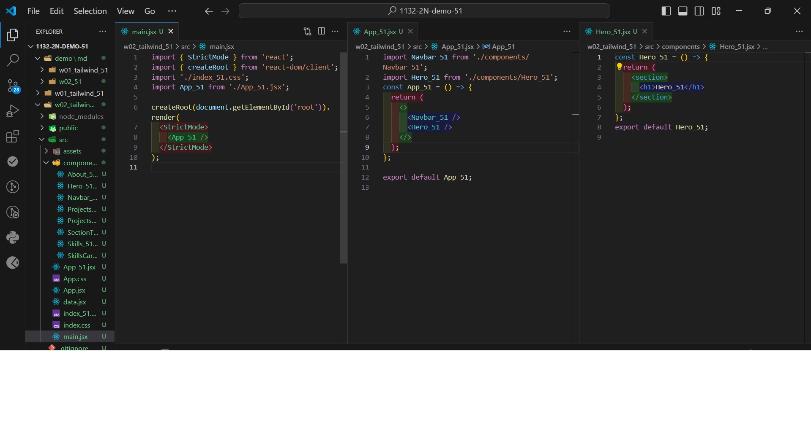
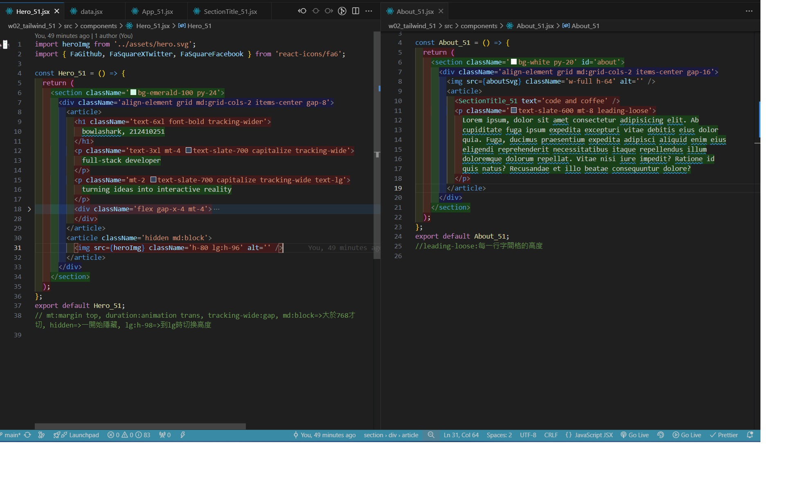
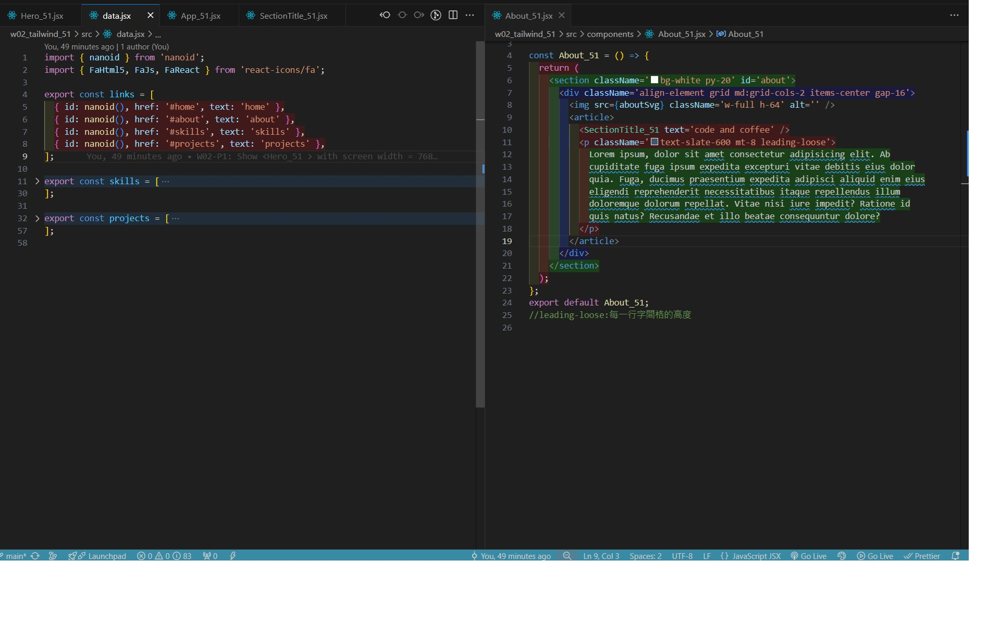
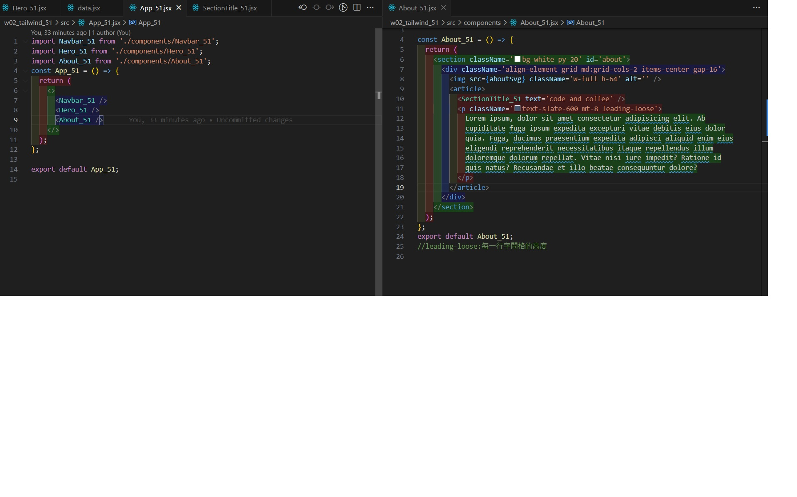
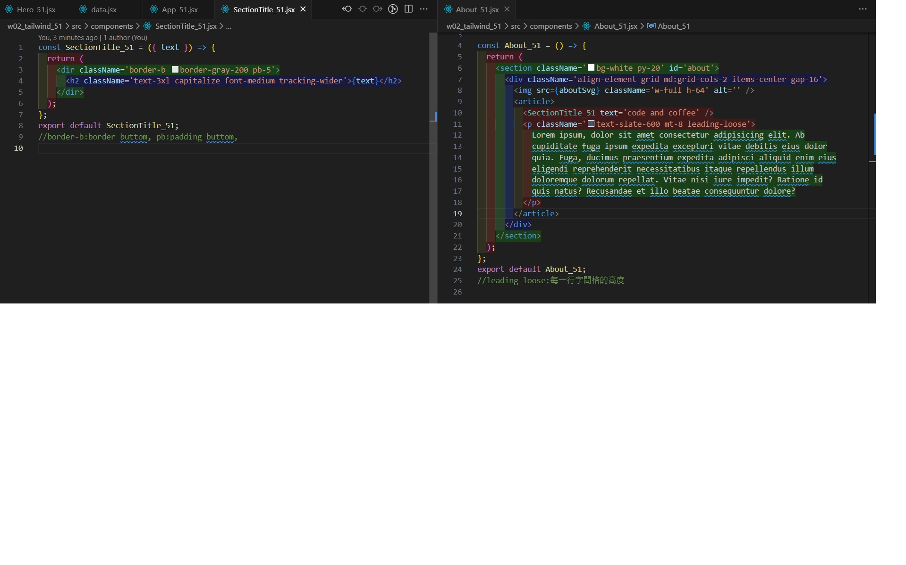
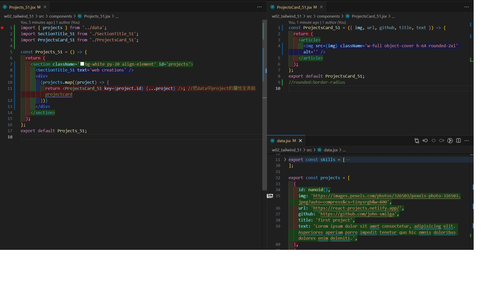
navbar
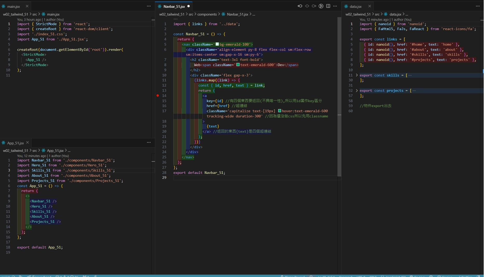
hero
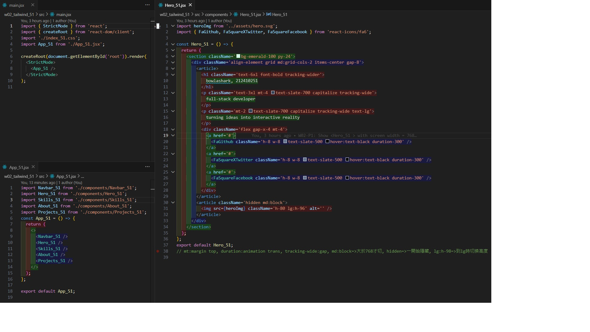
about
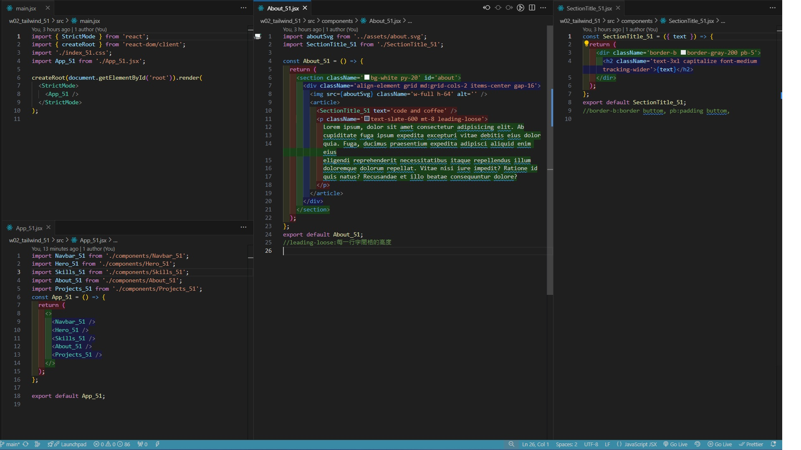
skills
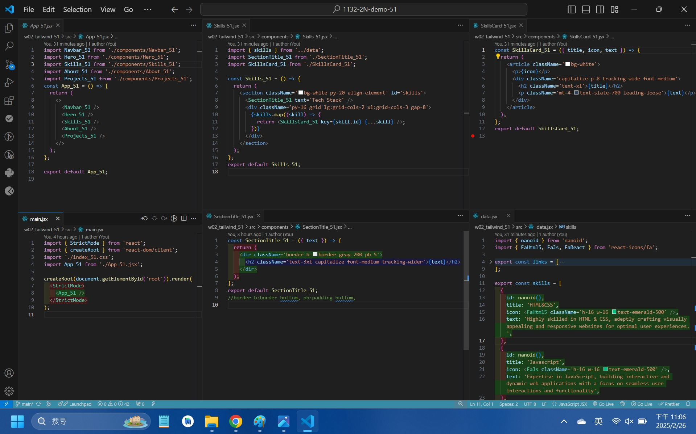
project
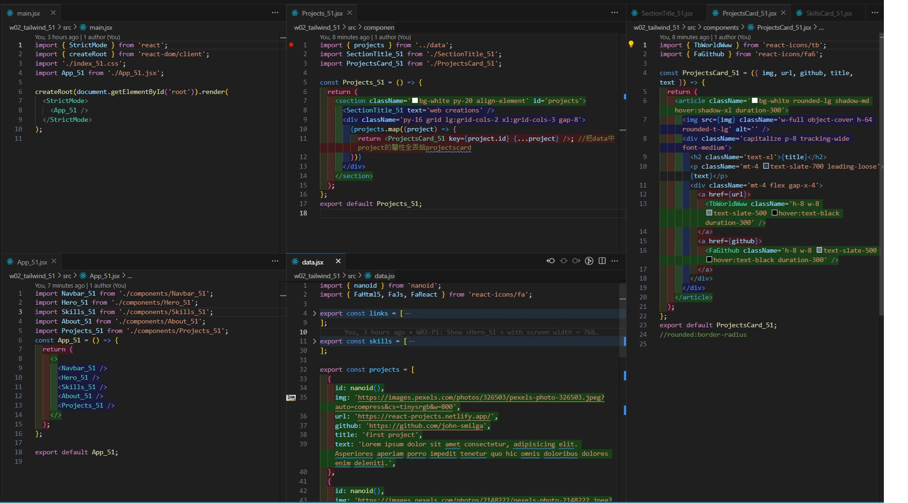
