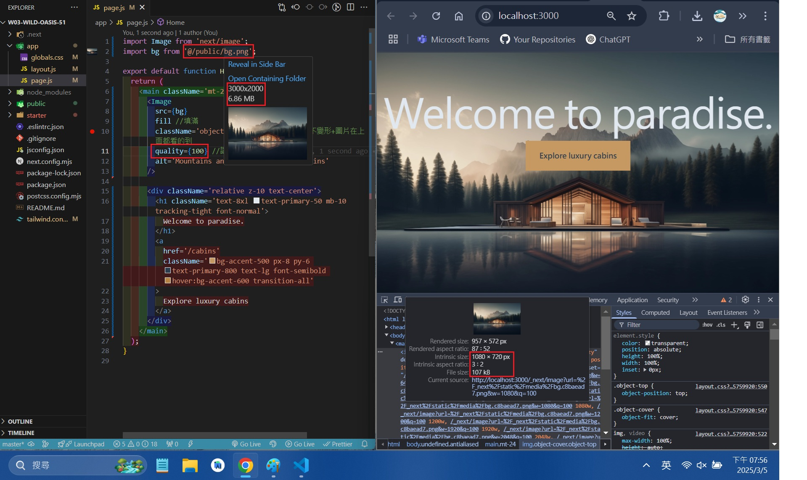
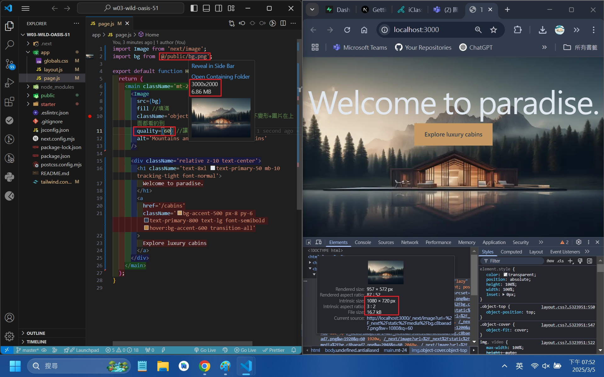
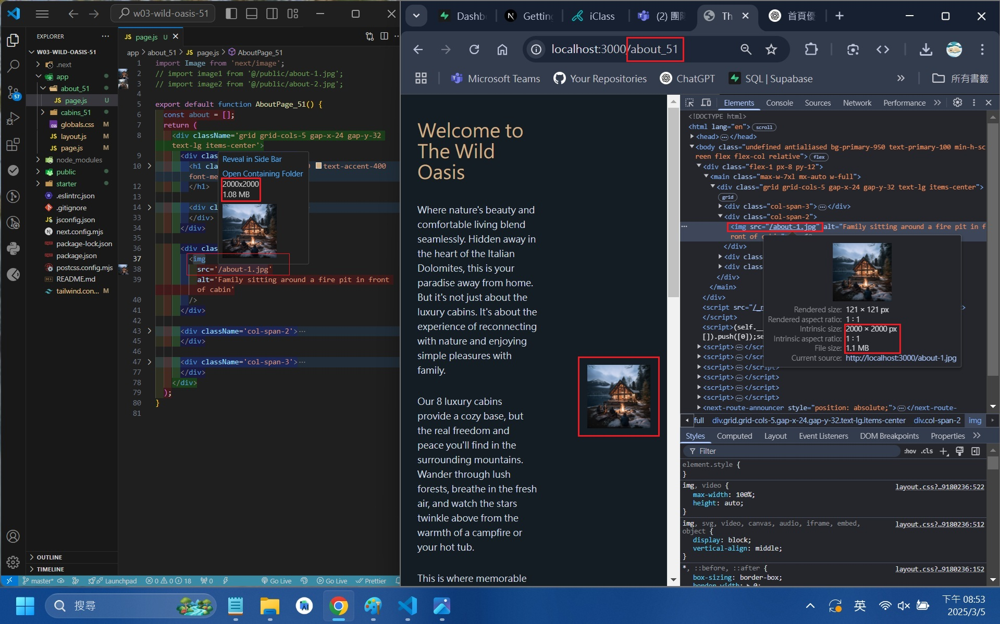
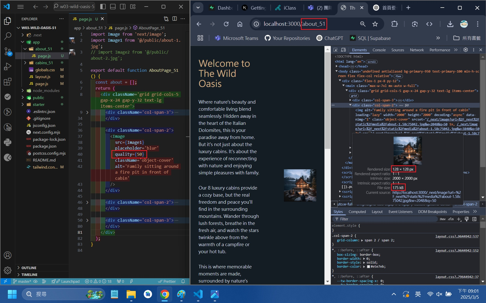
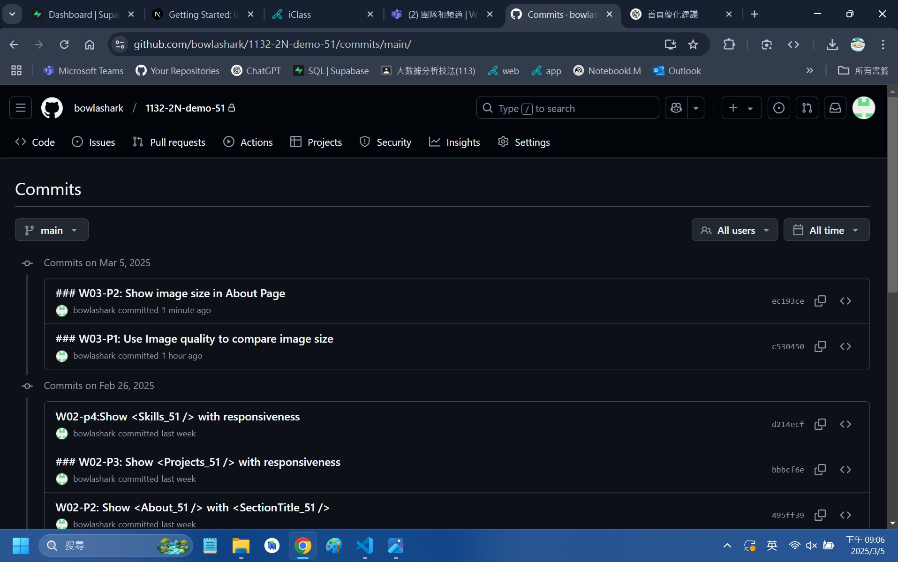
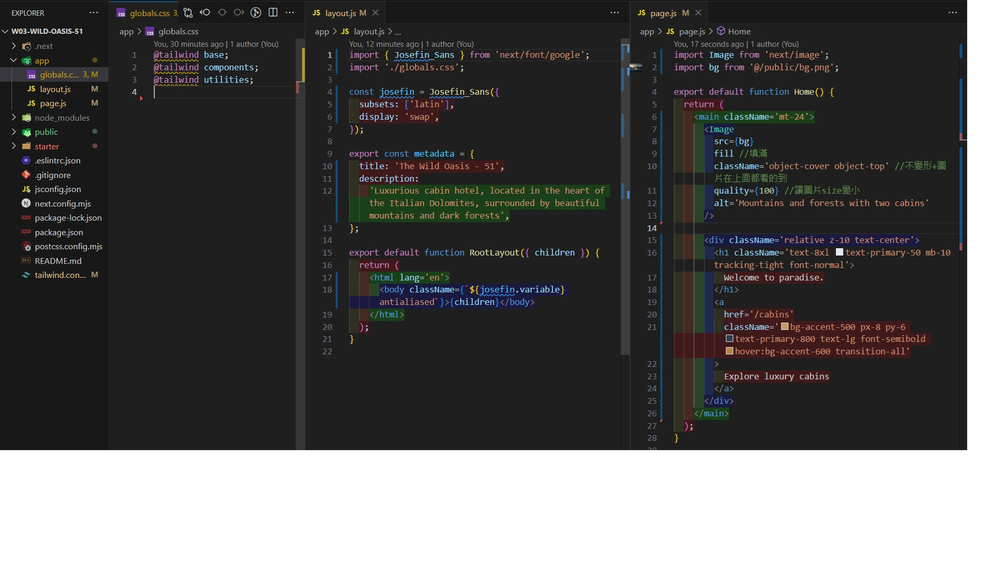
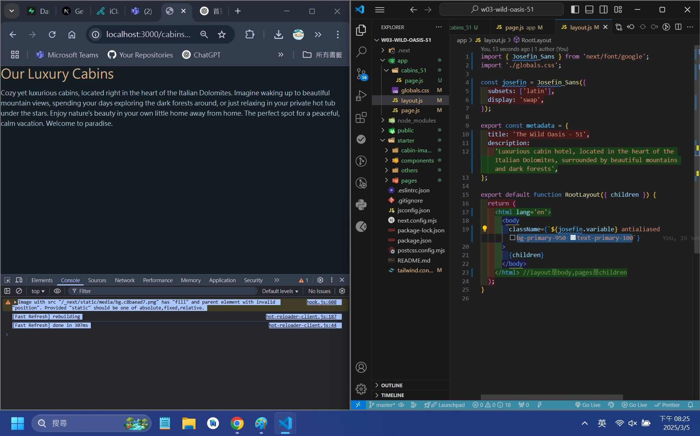

[Github URL](https://github.com/bowlashark/1132-2N-demo-51)

### W03-P1: Use Image quality to compare image size

#### => quality=100, image size = 107KB



#### => quality=60, , image size = 16.7KB(右部分)



#### => original image size, size = 6.86 MB(左部分)


```
c530450 bowlashark      Wed Mar 5 20:00:06 2025 +0800   ### W03-P1: Use Image quality to compare image size
```

### W03-P2: Show image size in About Page

#### => original image size, size = 1.1 MB



#### => use Image to optimize the image


#### => use Image with quality=50



```
ec193ce bowlashark      Wed Mar 5 21:04:52 2025 +0800   ### W03-P2: Show image size in About Page
c530450 bowlashark      Wed Mar 5 20:00:06 2025 +0800   ### W03-P1: Use Image quality to compare image size
```

### W03-P3:git logs



### note



