[Github URL](https://github.com/bowlashark/1132-2N-demo-51)

### W04-P1: Show Header_51 component with logo and nav items

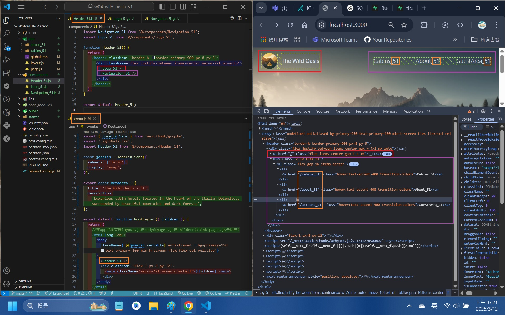

```
6abd2f6 bowlashark      Wed Mar 12 22:33:30 2025 +0800  W04-P3: Show 8 cabins correctly in the browser
b3c087d bowlashark      Wed Mar 12 22:32:46 2025 +0800  Create and get cabins data from Supabase
129156c bowlashark      Wed Mar 12 22:30:59 2025 +0800  W04-P1: Show Header_51 component with logo and nav items
```

### W04-P2: Create and get cabins data from Supabase

#### => setup cabins_51 table (8 data)

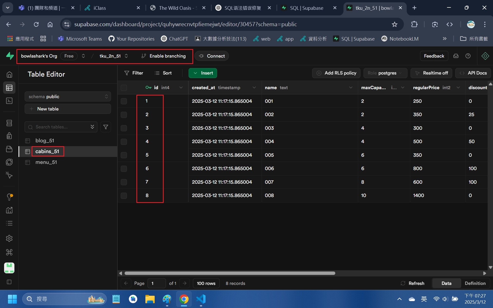

#### => sql command to create and insert data

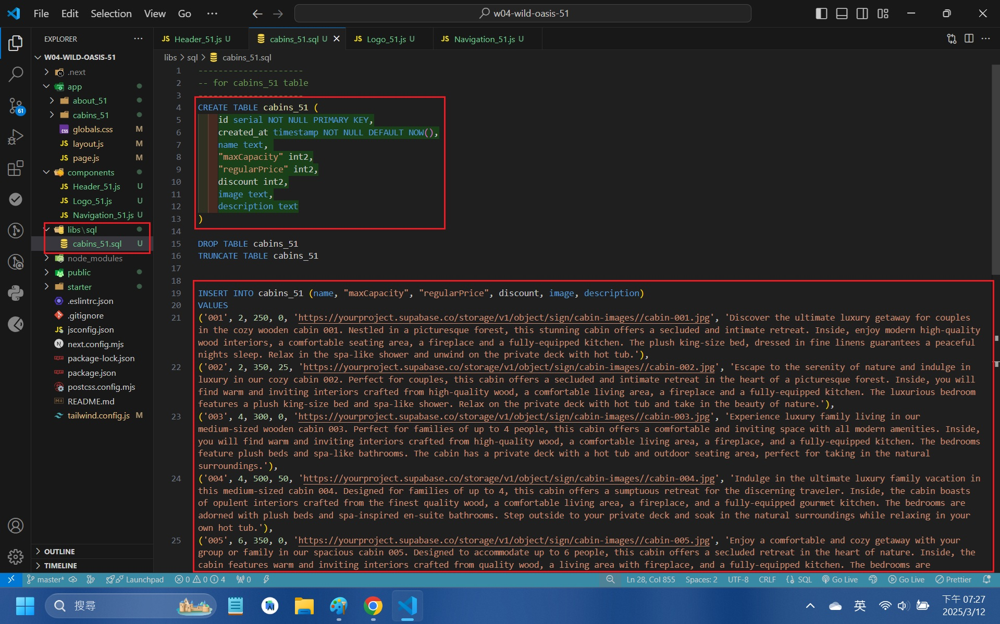

#### => show how to get Supabase URL and key

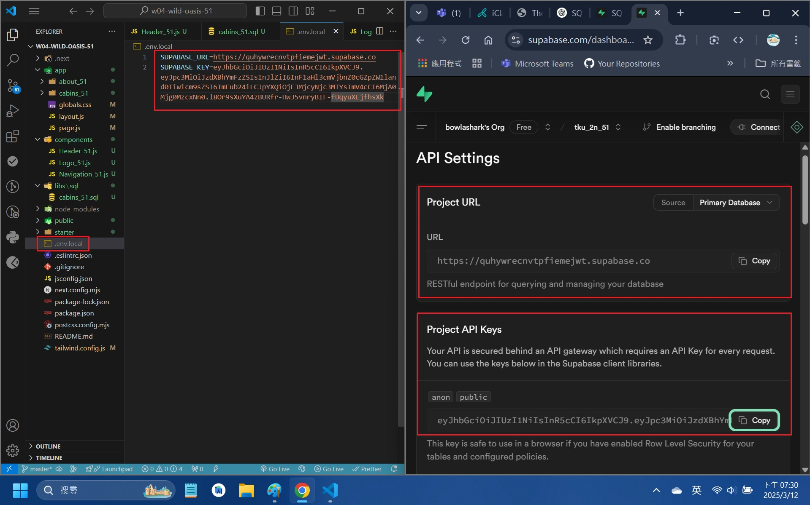

### => show how to use Supabase client to get cabins data

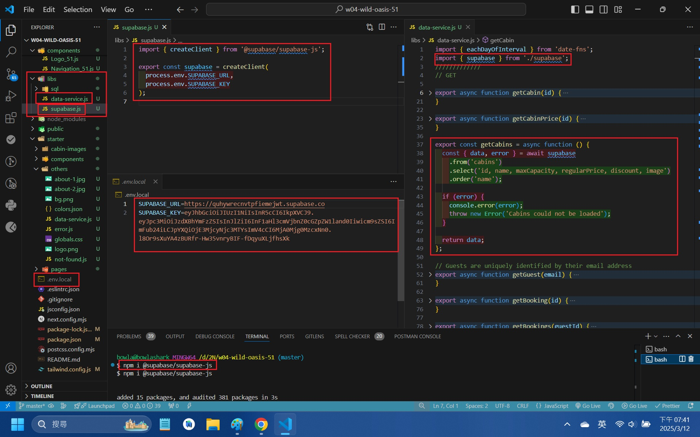

### => show cabins data in server console

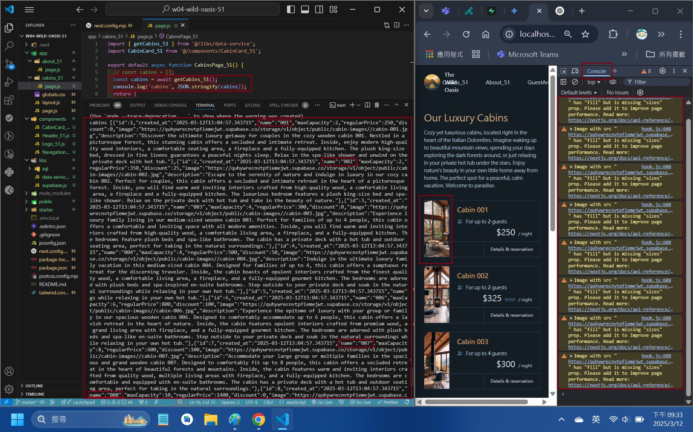

```
6abd2f6 bowlashark      Wed Mar 12 22:33:30 2025 +0800  W04-P3: Show 8 cabins correctly in the browser
b3c087d bowlashark      Wed Mar 12 22:32:46 2025 +0800  Create and get cabins data from Supabase
129156c bowlashark      Wed Mar 12 22:30:59 2025 +0800  W04-P1: Show Header_51 component with logo and nav items
```

### W04-P3: Show 8 cabins correctly in the browser

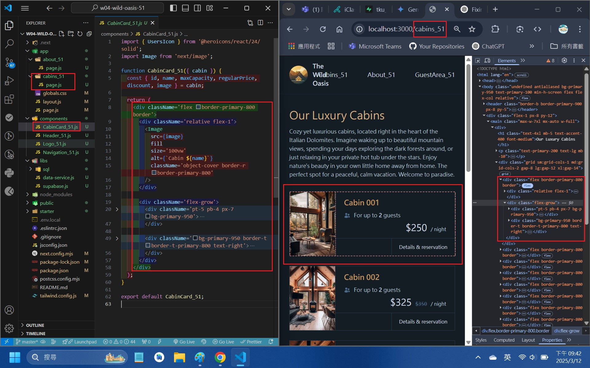

```
6abd2f6 bowlashark      Wed Mar 12 22:33:30 2025 +0800  W04-P3: Show 8 cabins correctly in the browser
b3c087d bowlashark      Wed Mar 12 22:32:46 2025 +0800  Create and get cabins data from Supabase
129156c bowlashark      Wed Mar 12 22:30:59 2025 +0800  W04-P1: Show Header_51 component with logo and nav items
```

### W04-P4: git logs

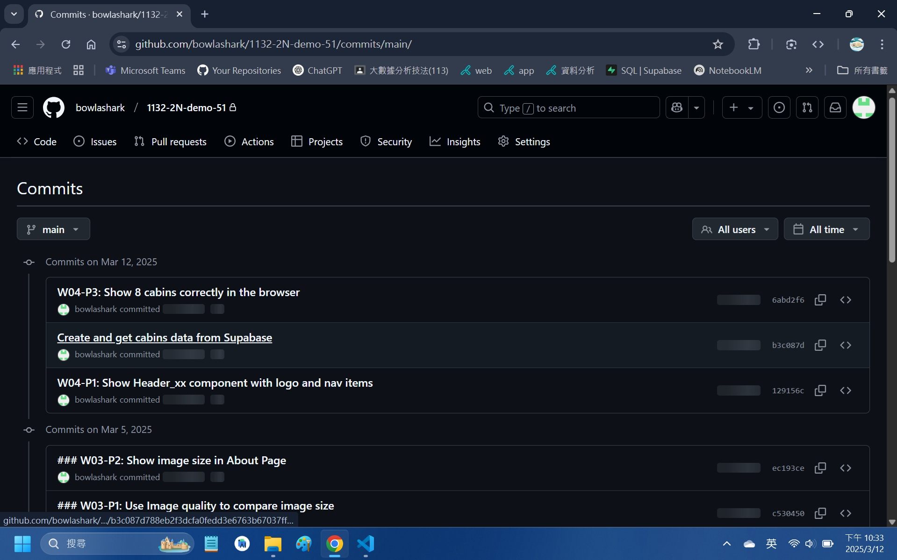

```
6abd2f6 bowlashark      Wed Mar 12 22:33:30 2025 +0800  W04-P3: Show 8 cabins correctly in the browser
b3c087d bowlashark      Wed Mar 12 22:32:46 2025 +0800  Create and get cabins data from Supabase
129156c bowlashark      Wed Mar 12 22:30:59 2025 +0800  W04-P1: Show Header_51 component with logo and nav items
```

### note

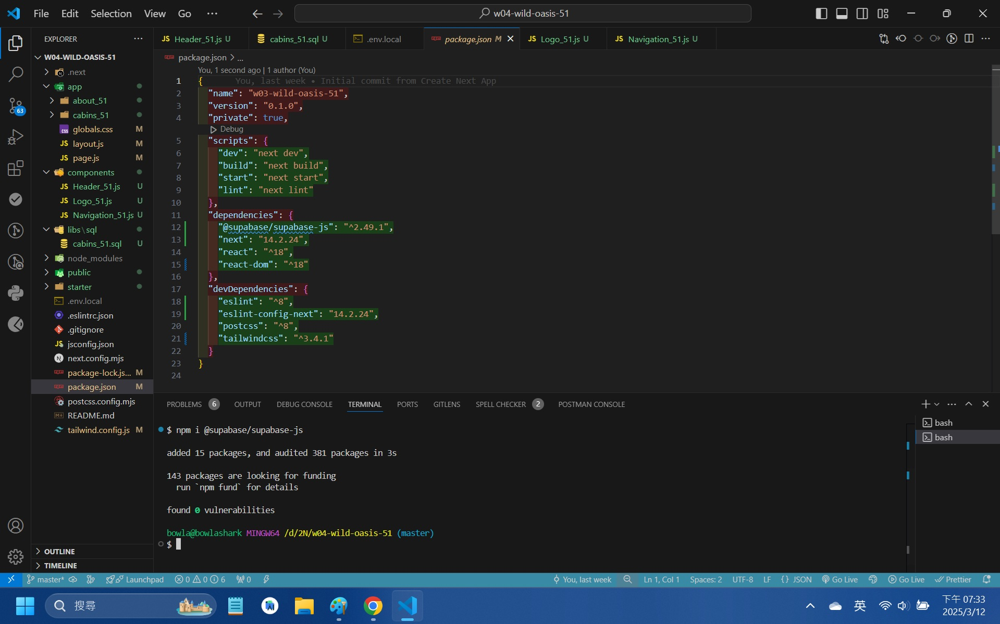
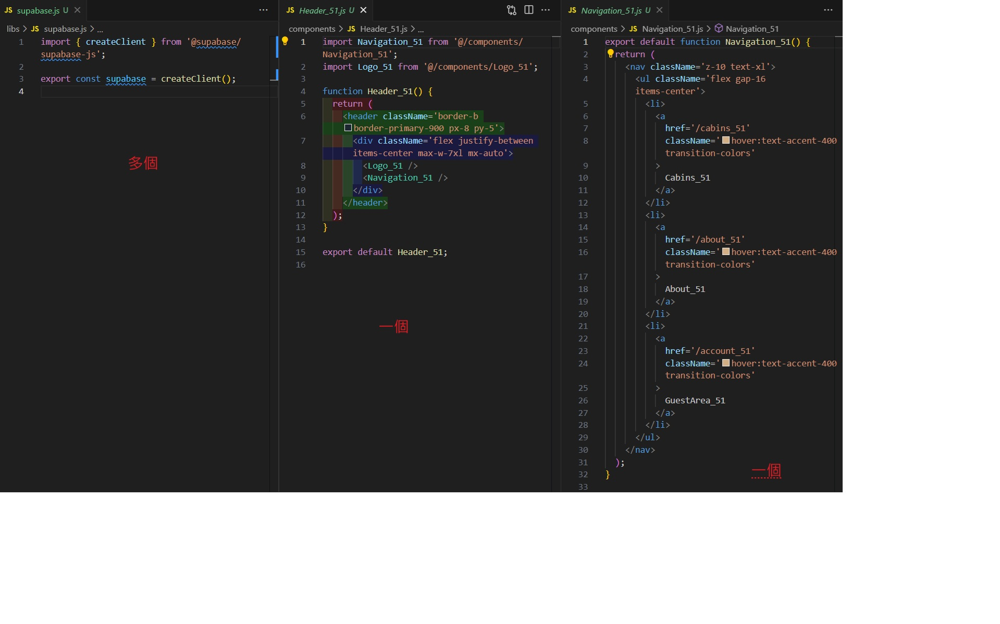
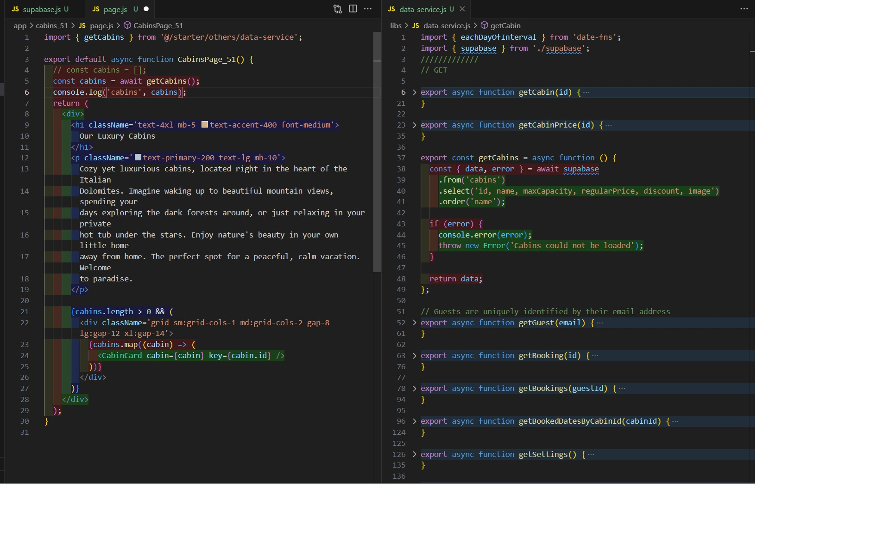
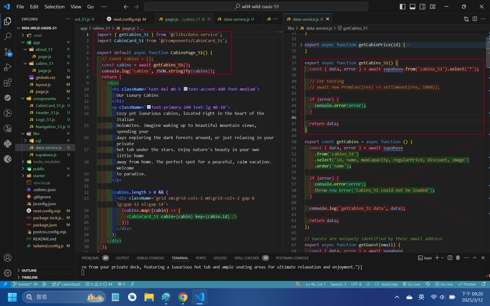
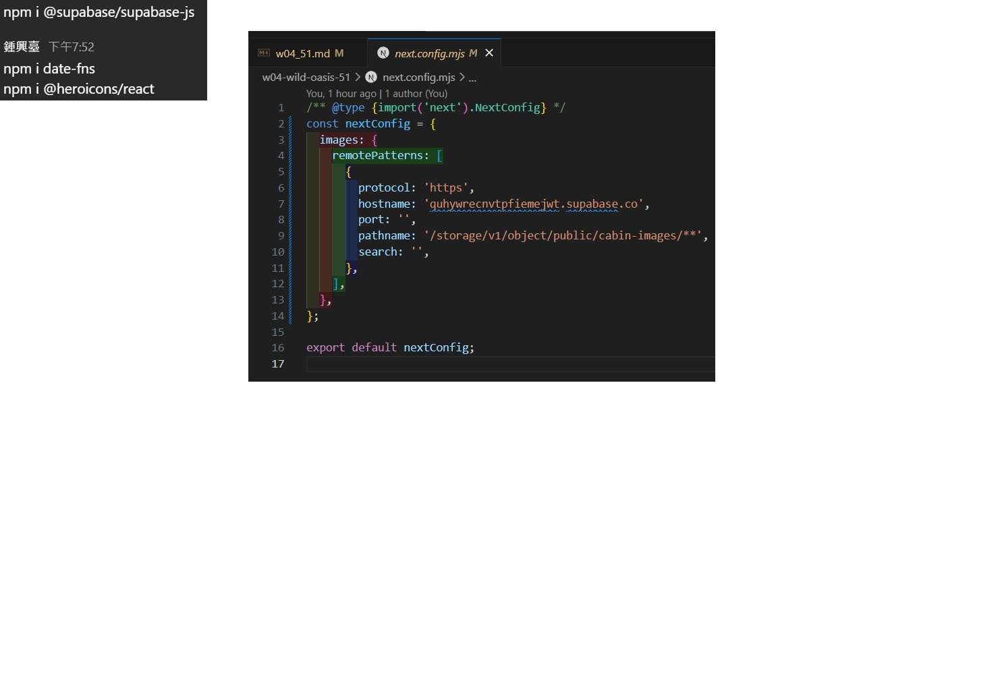
