[Github URL](https://github.com/bowlashark/1132-2N-demo-51)

### W05-P1: use route /cabins_51 to show static rending and dynamic rendering

#### => Show route /cabins_51 as static route by using "npm run build" command

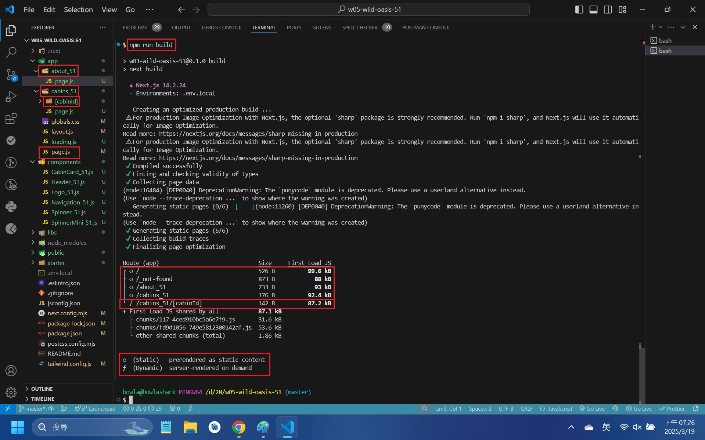

#### => change the price of cabin 1 in Supabase from 250 to 300, and refresh page, nothing change

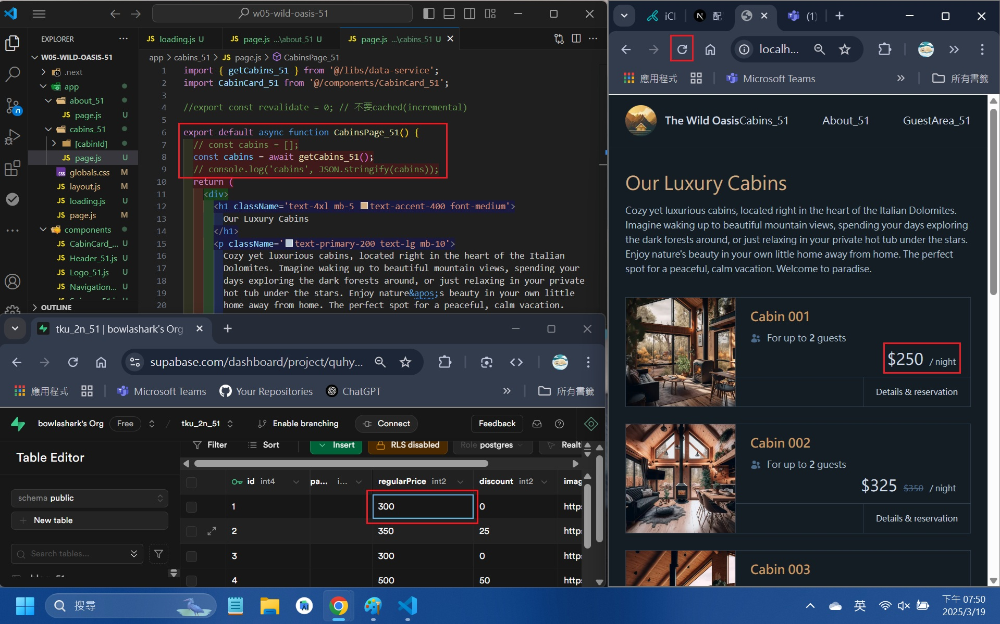

#### => Show route /cabins_51 as dynamic route by using "npm run build" command

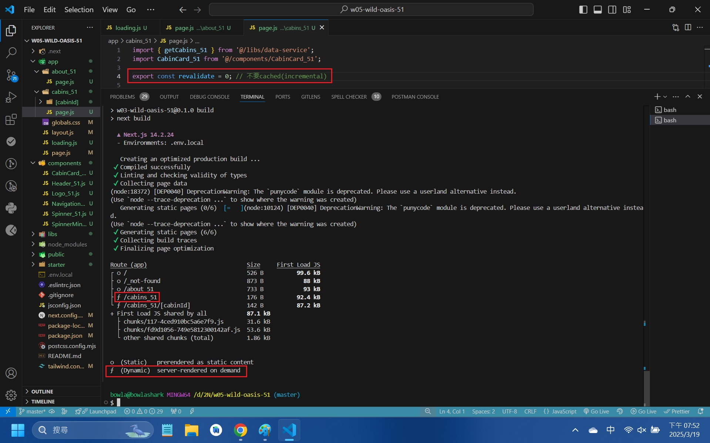

#### => change the price of cabin 1 in Supabase from 300 to 500, and refresh page, price does change

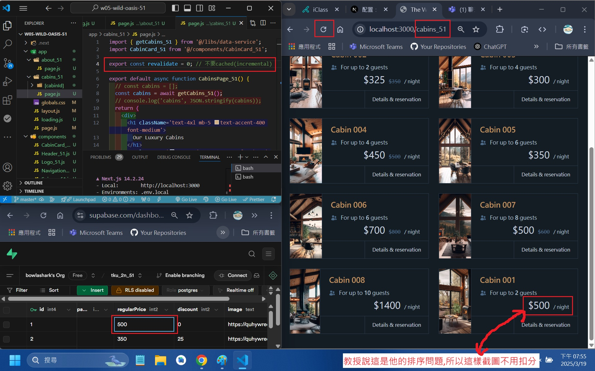

```
c94fbaf bowlashark      Wed Mar 19 21:13:10 2025 +0800  ### W05-P2: Implement route /cabins_51/cabinId, and use SSG (Static Site Generation) approach
f4575cb bowlashark      Wed Mar 19 21:11:58 2025 +0800  ### W05-P1: use route /cabins_51 to show static rending and dynamic rendering
```

### W05-P2: Implement route /cabins_51/cabinId, and use SSG (Static Site Generation) approach

#### => Implement route /cabins_51/cabinId using generateStaticParams()

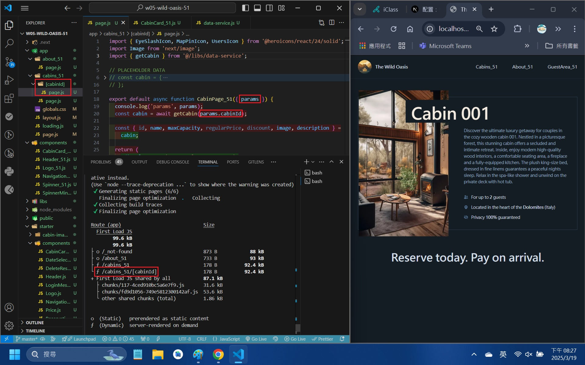

#### => show route /cabins_51/cabinId as SSG

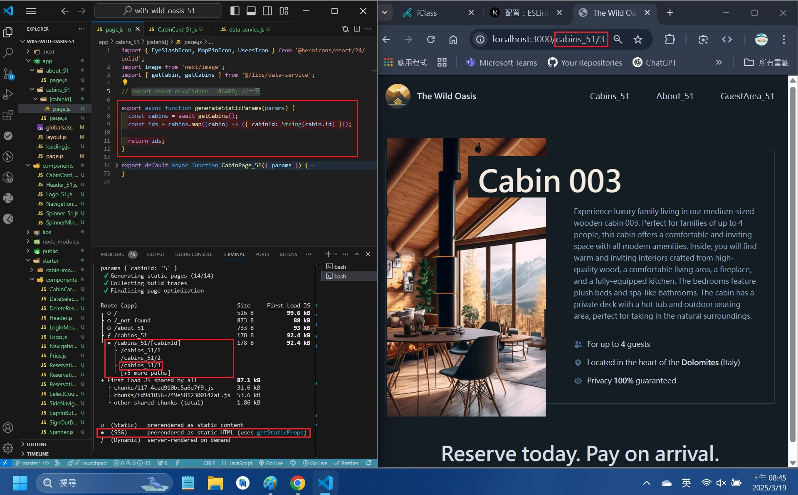

#### => change route /cabins_51/cabinId to dynamic route

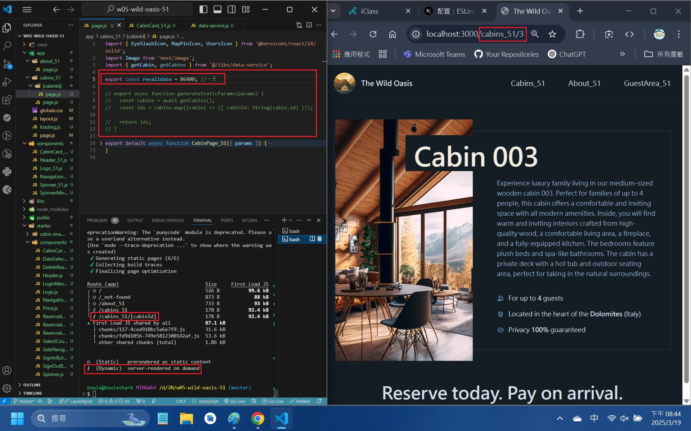

#### => run route /cabins_51/cabinId as SSG and change maxCapacity in Supabase, nothing happen

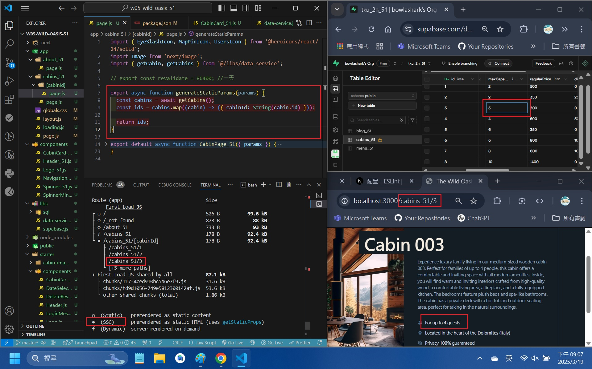

```
c94fbaf bowlashark      Wed Mar 19 21:13:10 2025 +0800  ### W05-P2: Implement route /cabins_51/cabinId, and use SSG (Static Site Generation) approach
f4575cb bowlashark      Wed Mar 19 21:11:58 2025 +0800  ### W05-P1: use route /cabins_51 to show static rending and dynamic rendering
```

### W05-logs: git logs of W05

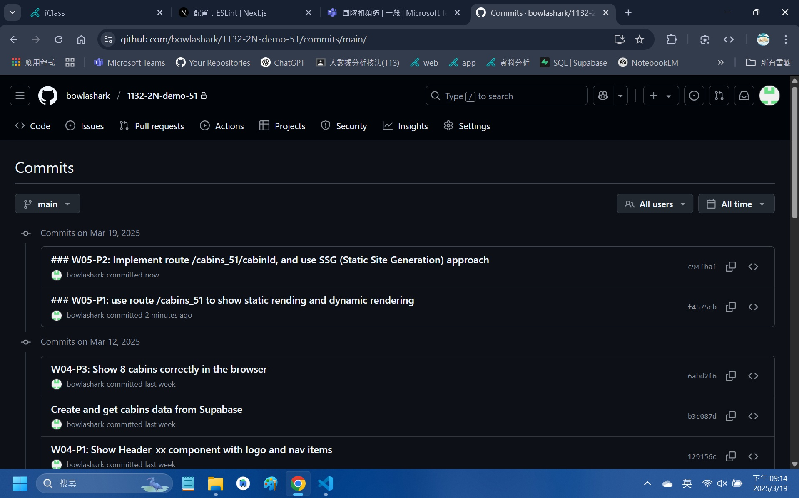

### note

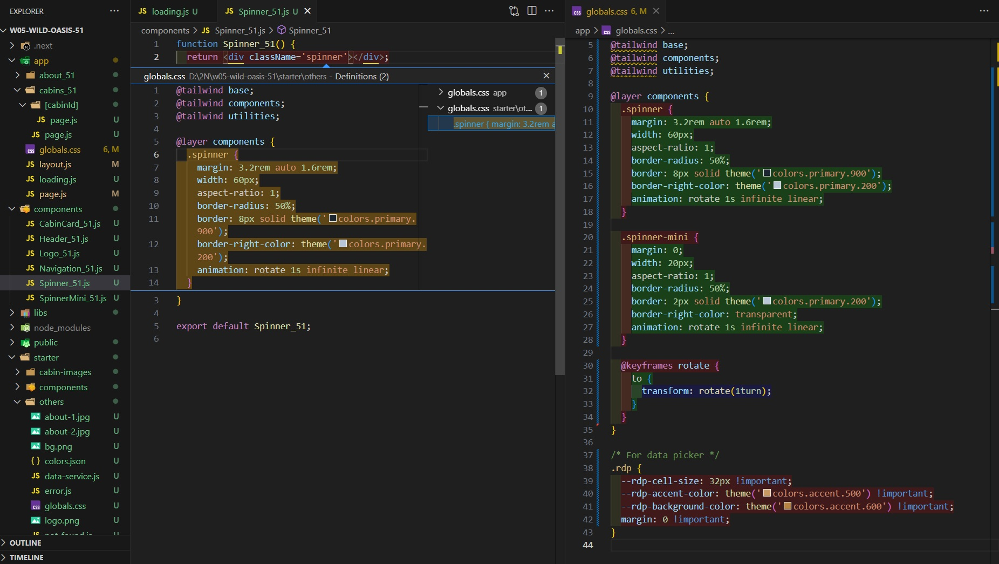
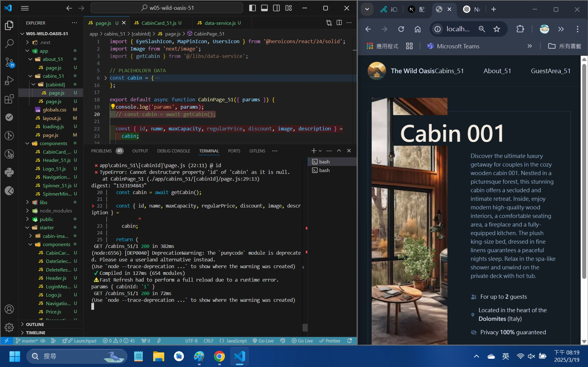
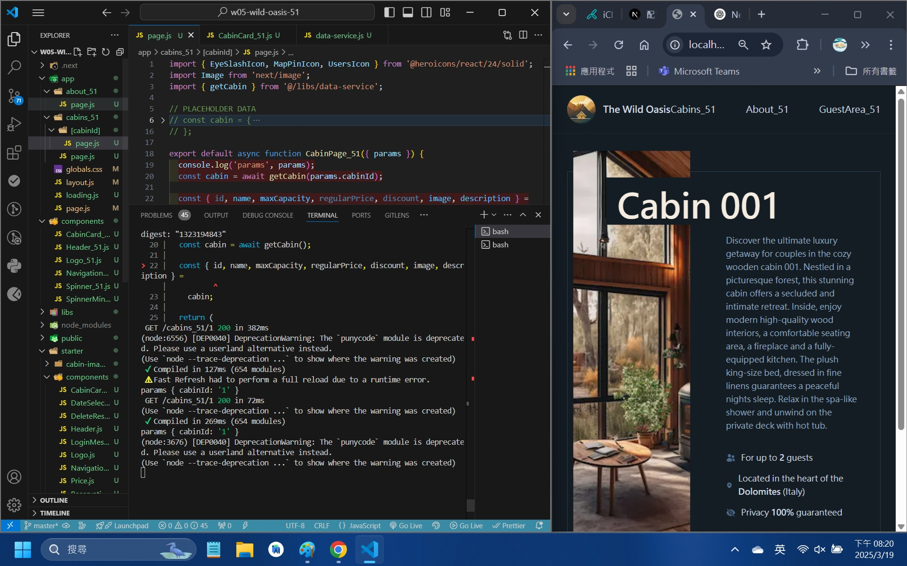
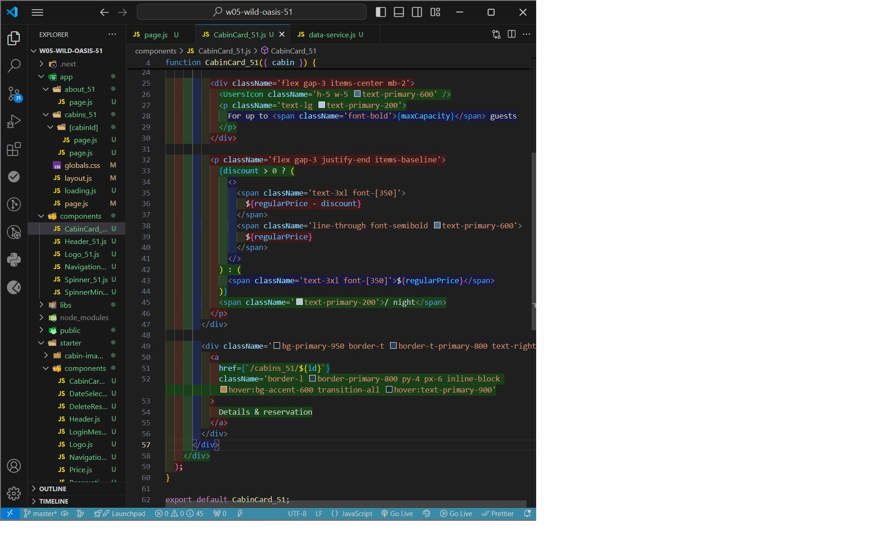
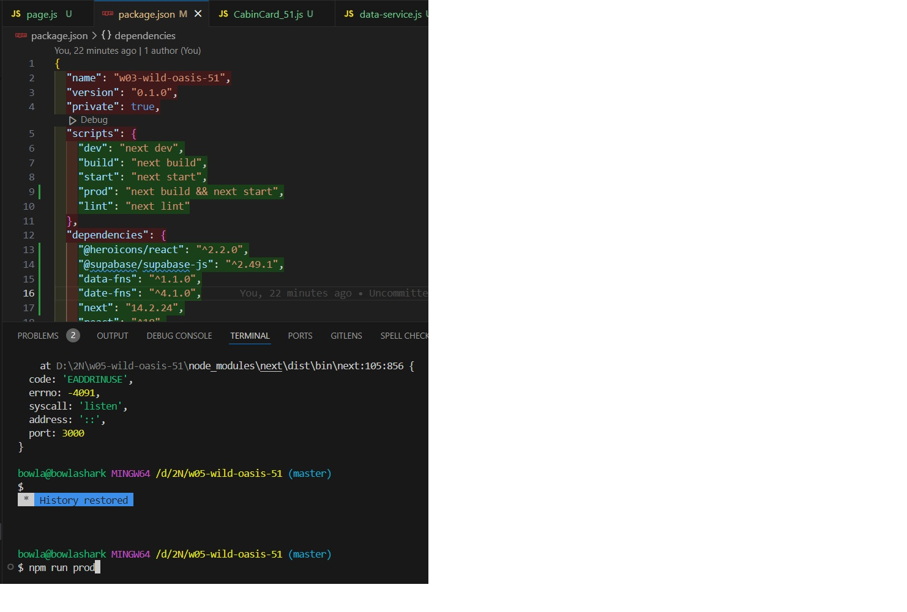
