[Github URL](https://github.com/bowlashark/1132-2N-demo-51)
[Vercel URL](https://113-2-n-prep-tests-51.vercel.app/)

### W06-P1: Show navigation for p1_51, p2_51, p3_51, p4_51

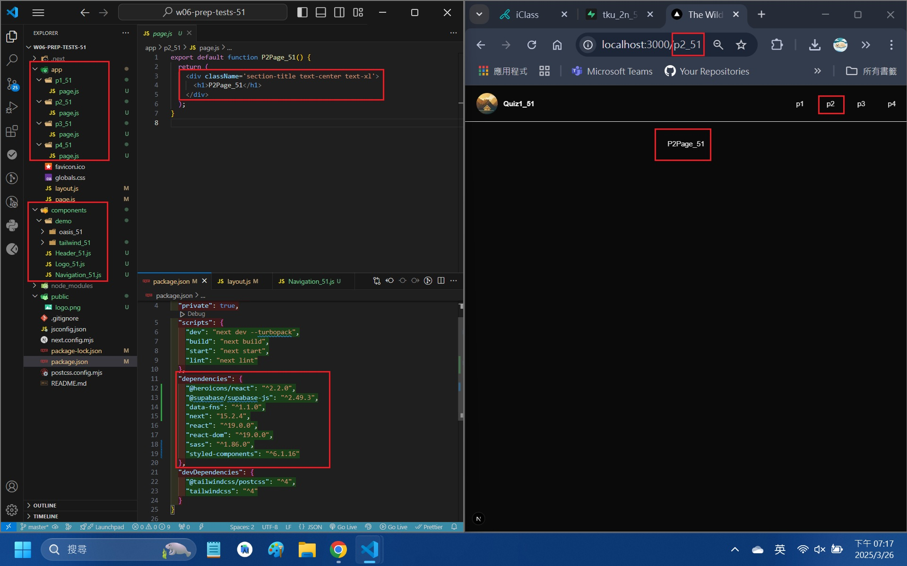

```
$ git log --pretty=format:"%h%x09%an%x09%ad%x09%s" --after="2025-03-25"
0fc2315 bowlashark      Wed Mar 26 23:10:04 2025 +0800  W06-P4: Implement route /quiz1/p3_51 to show all blogs in Vercel
b6b6d9a bowlashark      Wed Mar 26 23:09:29 2025 +0800  W06-P3: Implement route /quiz1/p2_51 to show static blogs
5dfe065 bowlashark      Wed Mar 26 23:08:45 2025 +0800  W06-P2: Implement route /quiz1/p1_51 to show all cabins
e7106ef bowlashark      Wed Mar 26 23:07:36 2025 +0800  W06-P1: Show navigation for p1_51, p2_51, p3_51, p4_51
```

### W06-P2: Implement route /quiz1/p1_51 to show all cabins

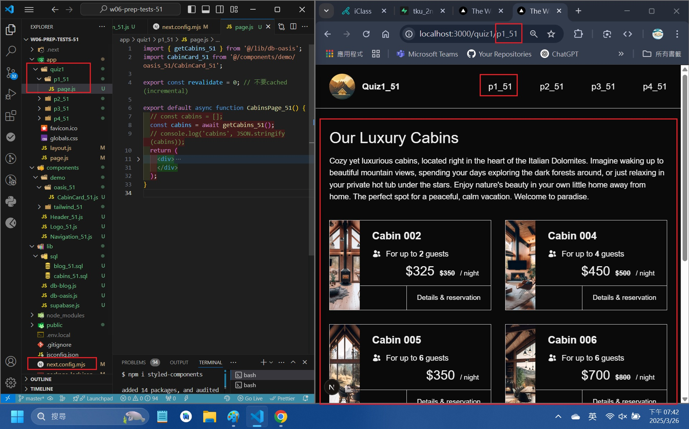

```
$ git log --pretty=format:"%h%x09%an%x09%ad%x09%s" --after="2025-03-25"
0fc2315 bowlashark      Wed Mar 26 23:10:04 2025 +0800  W06-P4: Implement route /quiz1/p3_51 to show all blogs in Vercel
b6b6d9a bowlashark      Wed Mar 26 23:09:29 2025 +0800  W06-P3: Implement route /quiz1/p2_51 to show static blogs
5dfe065 bowlashark      Wed Mar 26 23:08:45 2025 +0800  W06-P2: Implement route /quiz1/p1_51 to show all cabins
e7106ef bowlashark      Wed Mar 26 23:07:36 2025 +0800  W06-P1: Show navigation for p1_51, p2_51, p3_51, p4_51
```

#### W06-P3: Implement route /quiz1/p2_51 to show static blogs

#### => show static blogs

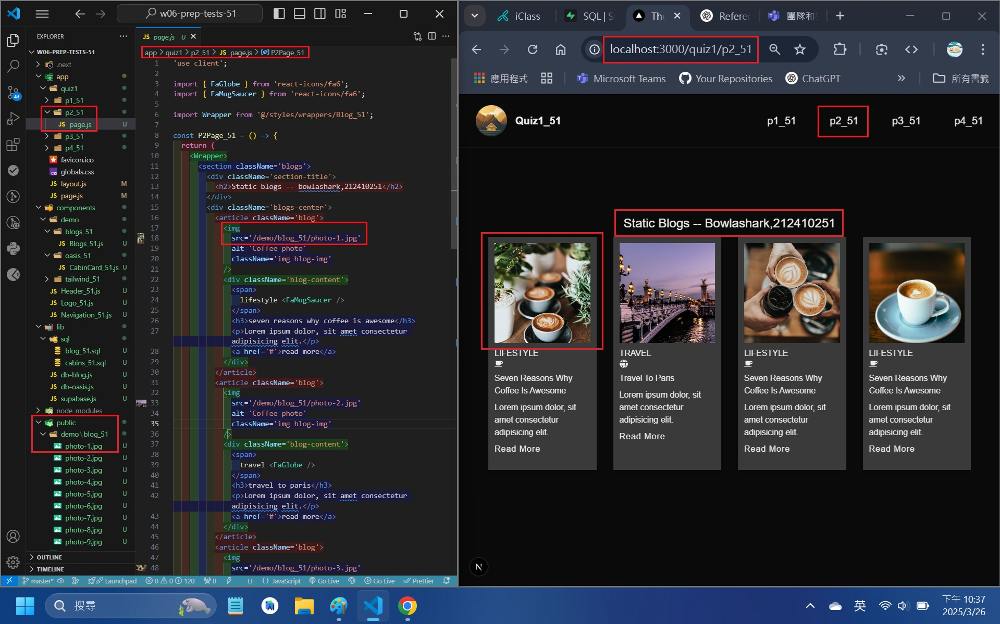

#### => show blog_51.sql with img pointing to /demo/blog_51 directory

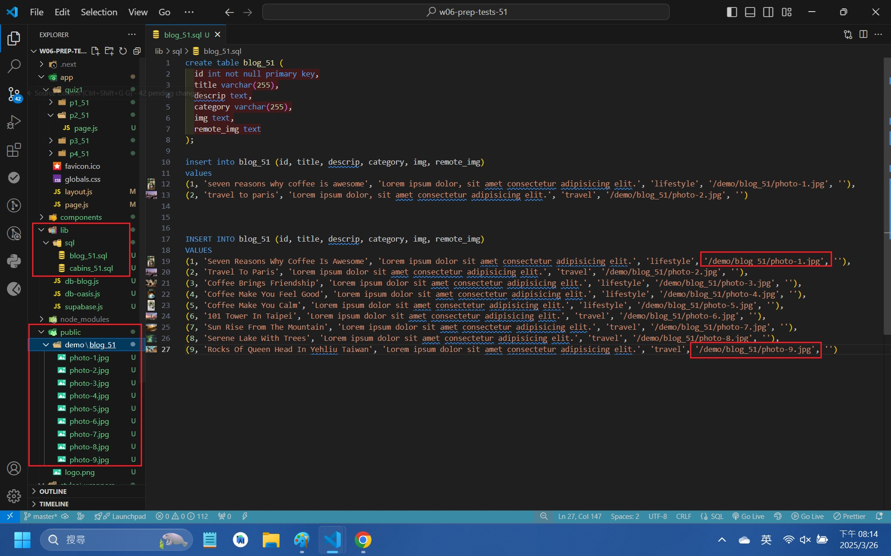

```
$ git log --pretty=format:"%h%x09%an%x09%ad%x09%s" --after="2025-03-25"
0fc2315 bowlashark      Wed Mar 26 23:10:04 2025 +0800  W06-P4: Implement route /quiz1/p3_51 to show all blogs in Vercel
b6b6d9a bowlashark      Wed Mar 26 23:09:29 2025 +0800  W06-P3: Implement route /quiz1/p2_51 to show static blogs
5dfe065 bowlashark      Wed Mar 26 23:08:45 2025 +0800  W06-P2: Implement route /quiz1/p1_51 to show all cabins
e7106ef bowlashark      Wed Mar 26 23:07:36 2025 +0800  W06-P1: Show navigation for p1_51, p2_51, p3_51, p4_51
```

### W06-P4: Implement route /quiz1/p3_51 to show all blogs in Vercel

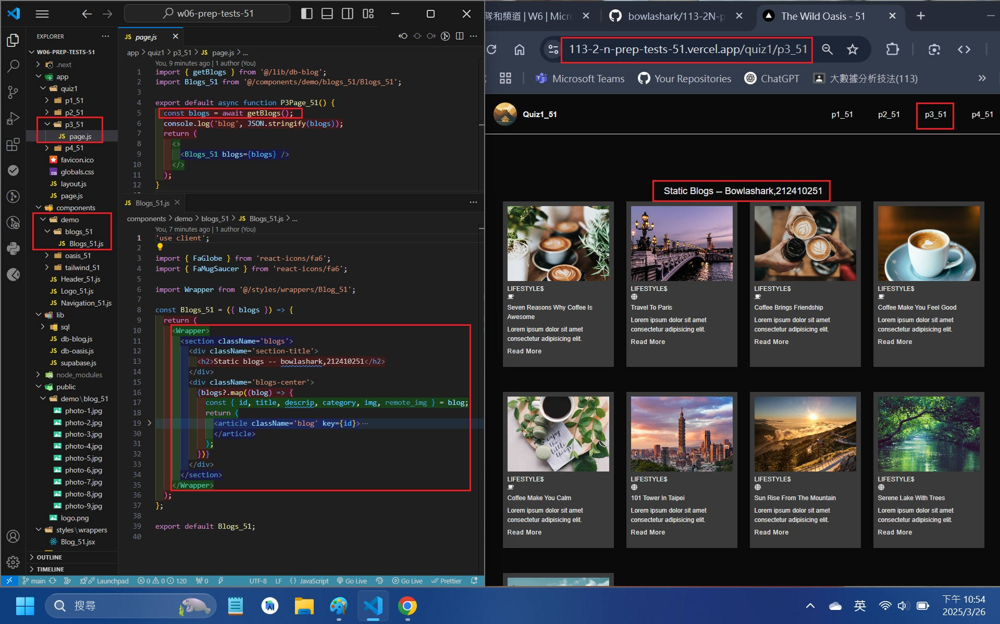

```
$ git log --pretty=format:"%h%x09%an%x09%ad%x09%s" --after="2025-03-25"
0fc2315 bowlashark      Wed Mar 26 23:10:04 2025 +0800  W06-P4: Implement route /quiz1/p3_51 to show all blogs in Vercel
b6b6d9a bowlashark      Wed Mar 26 23:09:29 2025 +0800  W06-P3: Implement route /quiz1/p2_51 to show static blogs
5dfe065 bowlashark      Wed Mar 26 23:08:45 2025 +0800  W06-P2: Implement route /quiz1/p1_51 to show all cabins
e7106ef bowlashark      Wed Mar 26 23:07:36 2025 +0800  W06-P1: Show navigation for p1_51, p2_51, p3_51, p4_51

```

### W06-logs: git logs of W06

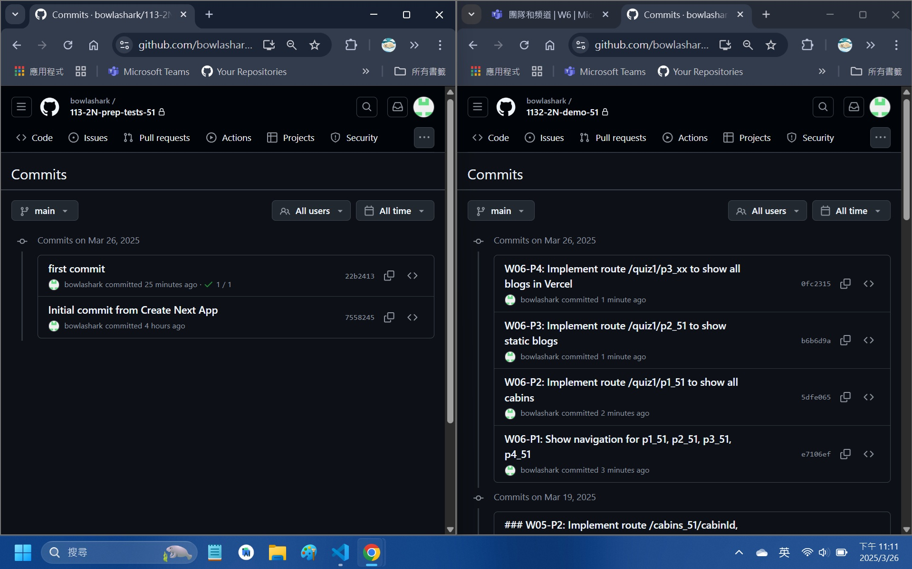

```
$ git log --pretty=format:"%h%x09%an%x09%ad%x09%s" --after="2025-03-25"
0fc2315 bowlashark      Wed Mar 26 23:10:04 2025 +0800  W06-P4: Implement route /quiz1/p3_51 to show all blogs in Vercel
b6b6d9a bowlashark      Wed Mar 26 23:09:29 2025 +0800  W06-P3: Implement route /quiz1/p2_51 to show static blogs
5dfe065 bowlashark      Wed Mar 26 23:08:45 2025 +0800  W06-P2: Implement route /quiz1/p1_51 to show all cabins
e7106ef bowlashark      Wed Mar 26 23:07:36 2025 +0800  W06-P1: Show navigation for p1_51, p2_51, p3_51, p4_51
```

### note

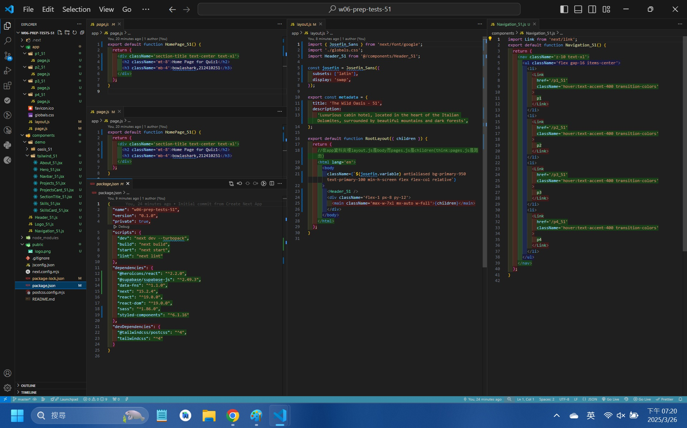
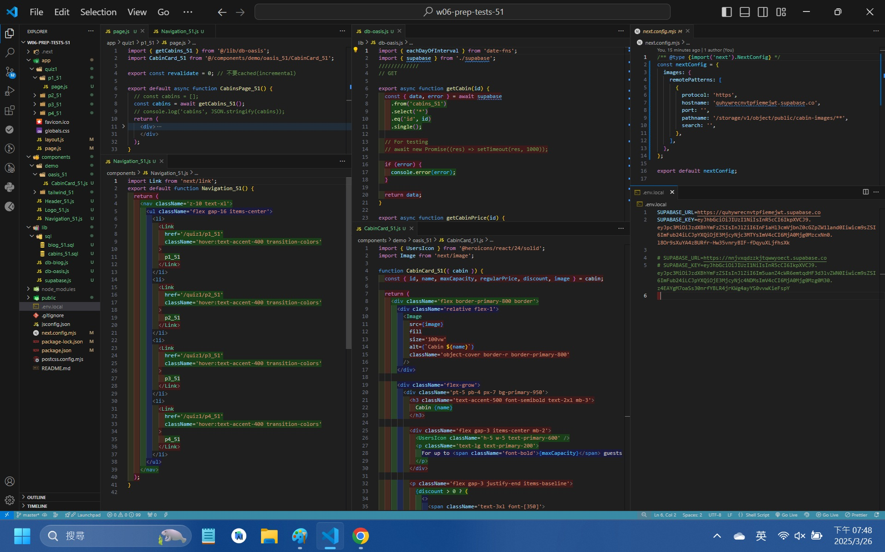
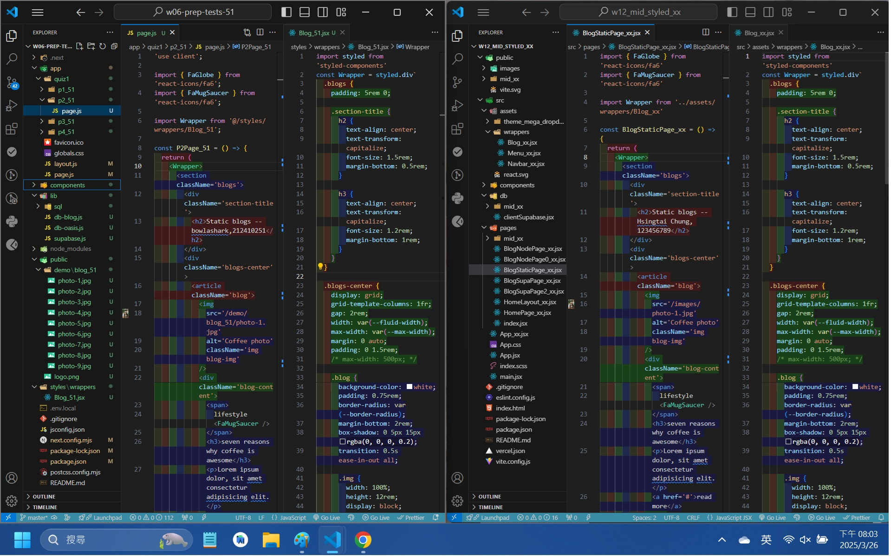
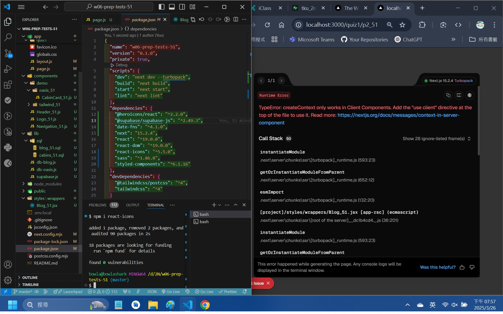
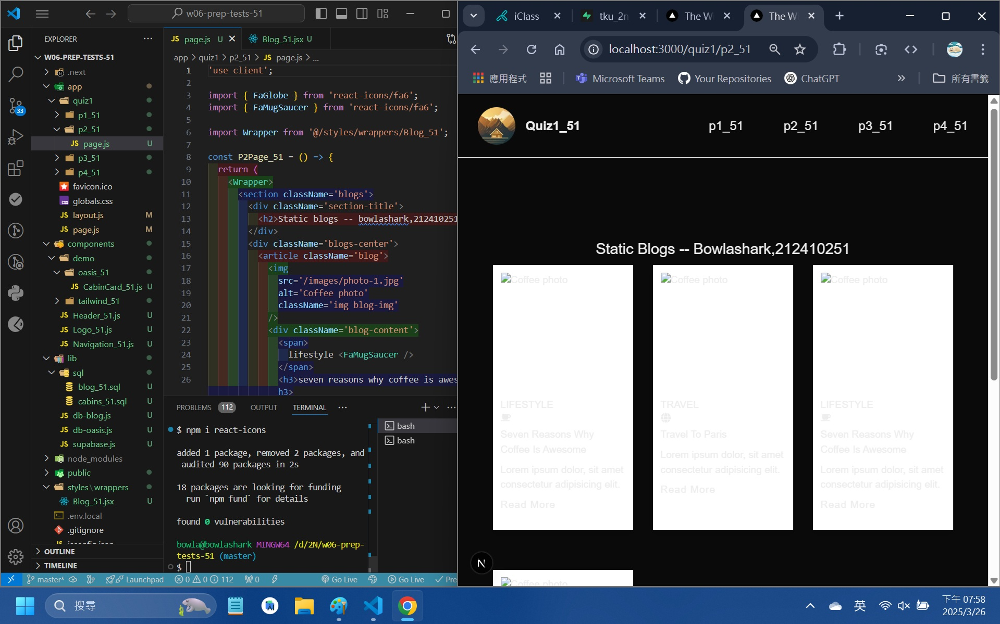
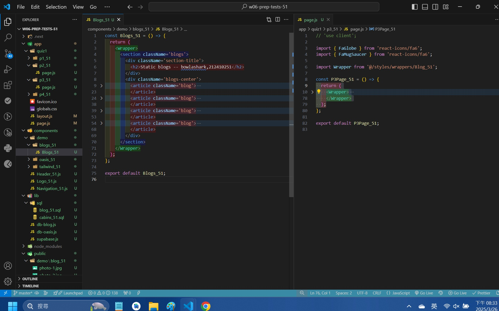
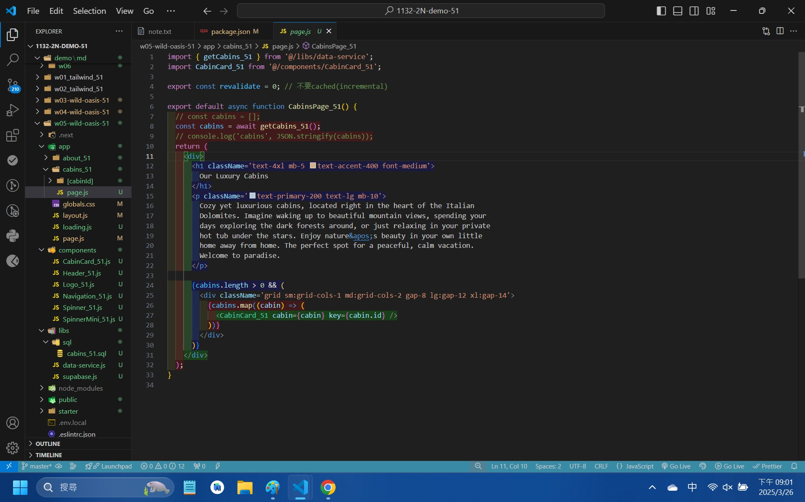
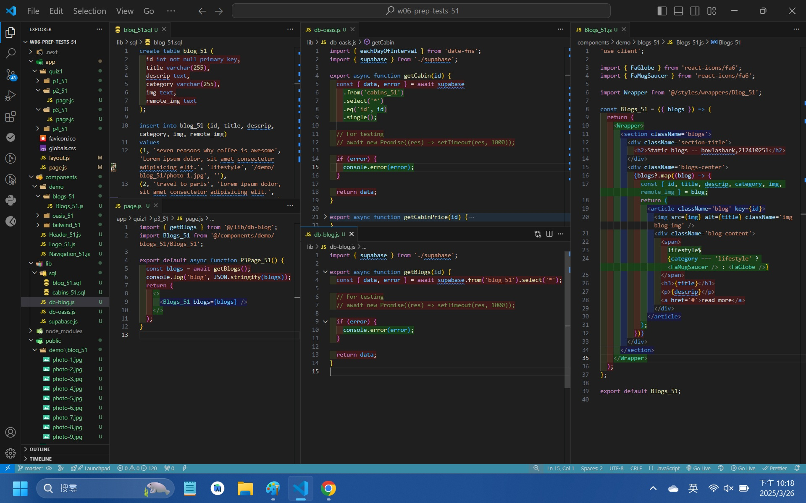

